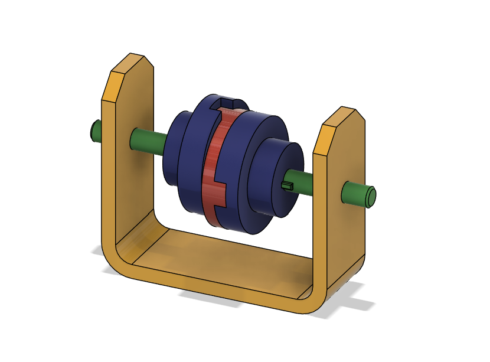
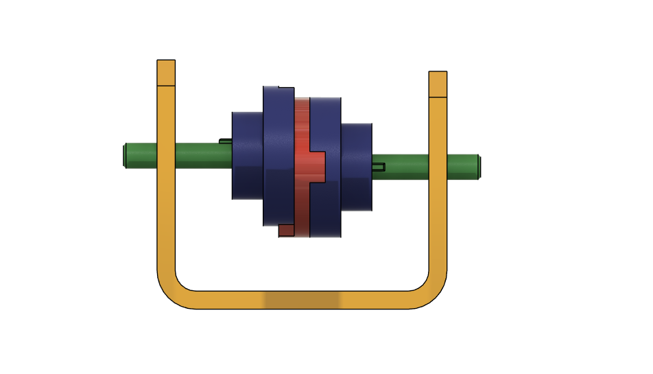
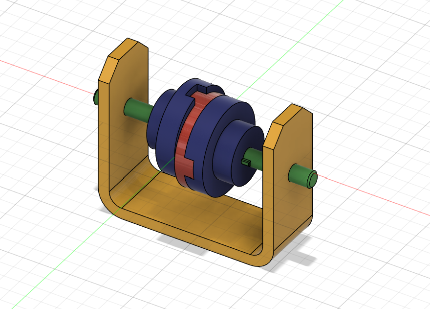
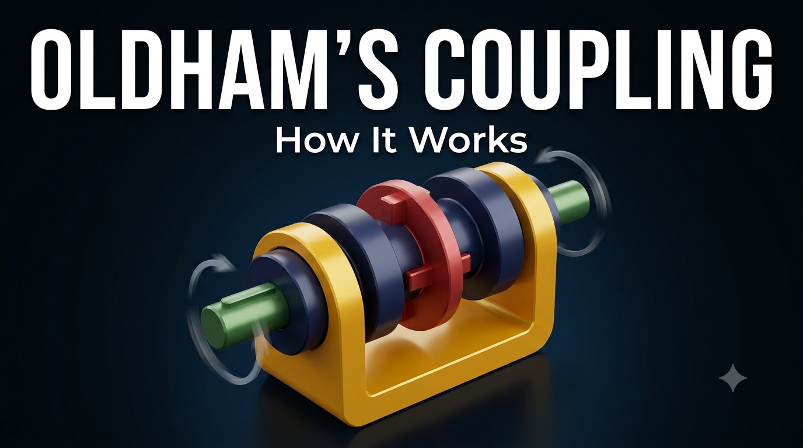

# Oldham's Coupling Mechanism

**Learning source:** Built while following a mechanism-design YouTube playlist ([playlist link](https://www.youtube.com/playlist?list=PL0fZjEQc8oaOYnjkYsIl-TSAJQPUNqa0v)).
Modeled independently in Autodesk Fusion 360 by Sumit Sahu.

📺 [Watch this build on YouTube](https://youtu.be/1DwmLDfwzwE)

## Objective
Model and assemble a working Oldham's coupling — a mechanism that transmits rotation between two parallel but offset (non-collinear) shafts at a constant angular velocity, using an intermediate floating disc with perpendicular sliding tabs.

## Skills Practiced
- Multi-body assembly design with correctly defined joints between separate components
- Revolute joints for the two shaft-to-yoke rotational connections
- Slider (prismatic) joints between the floating center disc and each driven/driving hub, allowing the perpendicular offset to be absorbed
- U-shaped yoke/frame design supporting two independent rotating shafts
- Motion study / mechanism validation to confirm the coupling correctly transmits rotation with the shafts offset

## CAD Features Used
- Sketch (yoke profile, shaft profiles, hub and floating disc profiles)
- Extrude (yoke frame, shafts, hubs, floating center disc)
- Joints: Revolute (shaft-to-yoke), Slider (hub-to-floating-disc, on two perpendicular axes)
- Fillet (yoke frame edges)

## Challenges
Getting the floating center disc's two perpendicular tabs to correctly engage with matching slots on each hub — while keeping the assembly's motion physically valid (constant-velocity transmission despite the shaft offset) — required precisely defining the slider joints along the correct perpendicular axes rather than a single shared axis.

## How I Solved Them
Modeled each hub's slot and the floating disc's matching tab as a mating pair first, verified the fit in isolation, then added the joints in Fusion 360's assembly environment one at a time — starting with the two shaft revolute joints, then adding each slider joint — testing the motion study after each addition rather than defining all joints at once. This made it much easier to catch an incorrectly oriented slider axis early.

## Engineering Notes
An Oldham's coupling is a classic mechanical solution for connecting two shafts that are parallel but not collinear (laterally offset) — unlike a simple rigid coupling, it accommodates that offset without inducing bending loads on the shafts, by letting the center disc "float" and slide along two perpendicular axes as it rotates. This makes it useful in applications like pump drives, motor-to-load connections, and any setup where shaft misalignment is expected or unavoidable.

## Manufacturing Considerations
The hubs and floating disc would typically be machined from bar stock, with the slot/tab interfaces needing a controlled sliding fit — too tight and the coupling binds, too loose and it introduces backlash. The yoke/frame is a straightforward milled or fabricated bracket.

## Material Suggestions
Steel or aluminum hubs with a bronze or engineered-plastic floating disc are common in real Oldham couplings, since the disc's tabs experience continuous sliding wear and benefit from a lower-friction material than the hubs. For a 3D-printed practice/demonstration model, PLA or PETG is sufficient, though the sliding fit tolerances would need adjustment for smooth printed motion.

## Improvements
Adding a small clearance chamfer at the tab/slot edges would reduce binding risk in the printed version, and increasing the fillet radius at the disc's slot corners would reduce stress concentration during operation.

## Time Taken
_Pending — let me know and I'll fill this in._

## Final Images

| View | Image |
|------|-------|
| Isometric |  |
| Front |  |
| Isometric (alt angle) |  |

## Video

📺 [Watch this build on YouTube](https://youtu.be/1DwmLDfwzwE)

Video file also included in this repo: [Video.mp4](Video/Video.mp4)

## Download Files
- [Model.step](CAD/Model.step)
- [Model.obj](CAD/Model.obj)
- [Model.mtl](CAD/Model.mtl)
