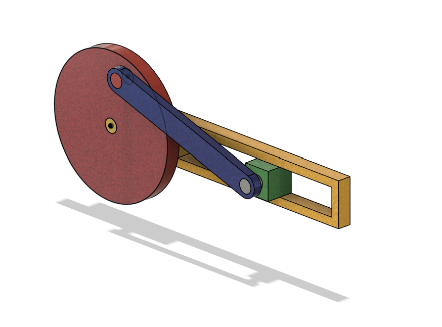
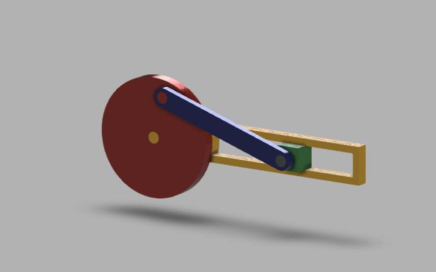

# Slider-Crank Mechanism

## Objective
Design a self-made slider-crank mechanism from scratch — a classic 4-bar motion assembly that converts rotary motion (flywheel) into linear reciprocating motion (slider block), using proper joint constraints instead of static positioning.

## Skills Practiced
- Multi-component assembly design in Fusion 360
- Joint-based motion constraints (Revolute + Slider)
- Angle correction for smooth, non-binding motion studies
- Component design for moving mechanical assemblies (flywheel, connecting rod, slider block, guide rail)

## CAD Features Used
- Revolute Joints (3) — flywheel-to-ground rotation, flywheel-to-connecting rod pin, connecting rod-to-slider pin
- Slider Joint (1) — slider block constrained to move linearly within the guide rail
- Assembly/Joint origins for aligning rotation and slide axes
- Motion study to validate full-cycle movement

## Challenges & How I Solved Them
The main challenge was getting the mechanism to move smoothly through a full rotation without binding or jumping. This came down to correcting the joint angles and origin alignment — even small misalignments in the revolute joint axes or the slider's travel axis caused the motion study to jitter or lock up partway through the cycle. Iterating on the joint origins and re-checking axis alignment on each component fixed this and gave a clean, continuous motion cycle.

## Engineering Notes
- 3 revolute joints handle all the rotational connections: fixed rotation of the flywheel, the crank pin joint, and the wrist pin joint at the slider end.
- 1 slider joint constrains the block to single-axis linear travel inside the rectangular guide rail — this is what converts the connecting rod's swinging motion into straight-line output.
- Getting joint hierarchy right (which component is the "base" vs "moving" in each joint) mattered as much as the angles themselves for a stable motion study.

## Manufacturing Considerations
- Flywheel: could be cast or machined (turned) as a disc with a hub bore for the crank pin
- Connecting rod: forged or CNC-machined, needs bushings/bearings at both pin joints to reduce friction and wear
- Slider block: needs a low-friction fit against the guide rail — bronze bushing or linear bearing in a real build
- Guide rail: extruded or machined channel section, must be dimensionally accurate for smooth slider travel

## Material Suggestions
- Flywheel: Cast iron or steel (adds rotational inertia for smoother motion)
- Connecting rod: Steel or aluminum (needs to handle cyclic tension/compression)
- Slider block: Bronze or hardened steel (wear resistance against the rail)
- Guide rail: Steel or aluminum extrusion

## Improvements
- Add bushings/bearings at the pin joints for a more realistic mechanical model
- Parametrize crank radius and rod length to study stroke length variation
- Add a driving motor/torque input for a dynamic motion simulation

## Time Taken
Not specified

## Final Images

## Download Files
- [Model.step](CAD/Model.step)
