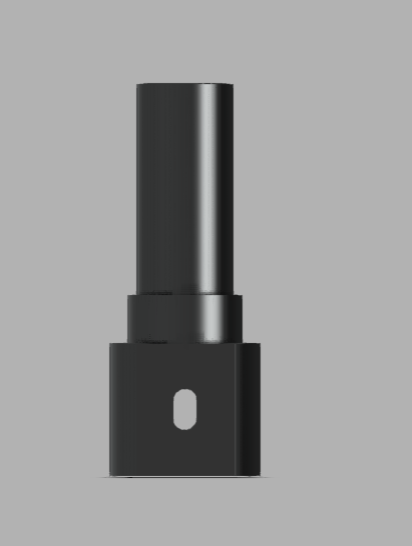
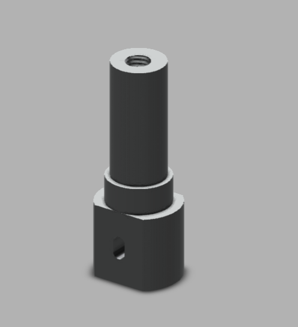

# Pinion Shaft & Clutch Guide — CAD Skill Assessment

**Context:** A two-part CAD skill assessment issued as part of a job application process. Each part was provided as a fully dimensioned 2D engineering drawing (with a section view) to be modeled in 3D. Modeled independently in Autodesk Fusion 360 by Sumit Sahu.

## Part 1: Pinion Shaft ✅ Complete

### Objective
Model a stepped pinion shaft from a dimensioned drawing: a small-diameter threaded shaft (M8×1.25, 15mm thread depth) stepped down to a mid-diameter collar, seated on a larger hex-cornered base block featuring a transverse through-hole.

### Brief (summarized in my own words)
- Threaded top shaft: Ø8mm thread (M8×1.25), 35mm length, 15mm thread depth
- Mid-step collar: Ø16mm
- Base block: Ø19mm boss with a hex-cornered outer profile, 22mm height
- Transverse through-hole: Ø3mm, R4 fillet at hole boss, offset 25mm from a reference edge
- Overall height: 62mm
- Material spec: EN24, tolerance ±0.1mm

### Skills Practiced
- Reading a fully dimensioned 2D drawing with a section view (Section A-A) and translating it into a stepped 3D shaft
- Internal thread modeling (M8×1.25 tapped hole) to the specified depth
- Multi-diameter stepped shaft construction via revolve/extrude
- Transverse through-hole placement with a filleted boss, referencing an offset dimension from the drawing
- Hex-cornered base transition from a round boss

### CAD Features Used
- Sketch (shaft profile for revolve, base block profile, hole placement)
- Revolve (main stepped shaft body)
- Extrude (hex-cornered base block)
- Extrude Cut (transverse through-hole)
- Thread (internal M8×1.25 tapped feature)
- Fillet (hole boss transition)

### Challenges
Matching the exact stepped diameters and the internal thread depth precisely to the drawing's Section A-A callout, while keeping the transverse hole's offset dimension (25mm) referenced correctly from the drawing's stated datum rather than an assumed edge.

### How I Solved Them
Worked directly from the section view's stated depths and diameters as the primary reference for the revolve profile, and used Fusion 360's dimensioned sketch tools to lock the transverse hole's position to the same 25mm offset shown in the drawing before cutting — checking the model's overall height (62mm) against the drawing at the end to confirm nothing had drifted during the build.

### Engineering Notes
This reads as a pinion shaft intended to be driven by a motor or coupling via the M8 threaded top (likely accepting a grub screw or coupling insert), with the hex-cornered base providing a wrench-flat style grip surface for assembly/disassembly, and the transverse hole likely serving as a locating pin or retaining feature.

### Material Suggestions
The drawing specifies **EN24** (a high-strength alloy steel), consistent with a shaft that would see torque and wear in a real gear/pinion application.

### Time Taken
_Pending — let me know and I'll fill this in._

### Final Images

| View | Image |
|------|-------|
| Front |  |
| Isometric |  |

### Download Files
- [Sumit_Sahu_Design1.step](CAD/Sumit_Sahu_Design1.step)

---

## Part 2: Clutch Guide ⬜ Not yet started

A separate part from the same assessment — a forked/yoke-style clutch guide bracket with a 140° angled fork, a central pivot bore (Ø8), and stepped section thickness. Will be added here once modeled.

---

_Note: the original assignment drawings are not included in this repo, as they were provided by the assessing company for evaluation purposes only. Only my own modeling work and deliverables are shown here._
