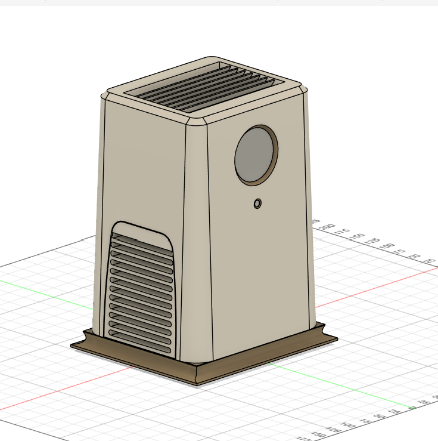
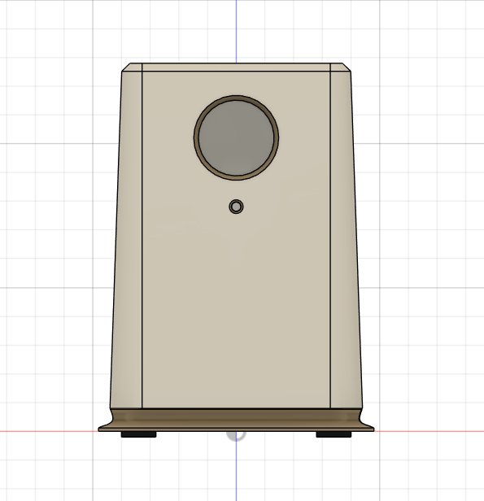
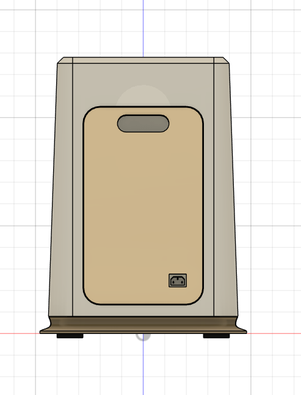

# Professional Assessments

This folder documents formal, client/company-issued CAD deliverables — timed skill assessments, take-home tests, or interview-stage design tasks — as distinct from my self-directed learning tracks elsewhere in this repo (30-Day Challenge, Machine Design Practice Pack, CAD Designs Practice Set).

Each assessment gets its own entry below, showing the brief (in my own words, not the original assignment document), my modeling approach, and the final deliverables produced.

---

# Smart Desktop Air Purifier — CAD Skill Assessment

**Context:** Completed as part of a timed CAD skill assessment during an internship/job application process. Modeled independently in Autodesk Fusion 360 by Sumit Sahu.

## Objective
Model a "Smart Desktop Air Purifier" enclosure from a written design specification within a fixed time limit, then produce a full deliverable package: native CAD file, neutral exchange formats, and a patent-style multi-view drawing set — simulating a real-world CAD engineering deliverable under deadline pressure.

## Brief (summarized in my own words)
- Overall envelope: 320 × 240 × 210 mm
- Tapered, rounded-rectangle main body profile
- Circular front display
- Top outlet featuring 7 vanes
- Side air intakes, each with 12 slots
- Rear service access panel
- Integrated flared base with 4 rubber feet

## Skills Practiced
- Interpreting a written (non-drawing) design specification and translating it directly into 3D geometry and dimensions
- Tapered rounded-rectangle loft/sweep for the main body
- Repeating vane and slot patterns (top outlet, side intakes) via Circular/Rectangular Pattern
- Multi-body design (rubber feet as separate bodies/components)
- Producing a full deliverable set under time pressure: native file, neutral formats (STEP/STL), and a formal patent-style drawing set

## CAD Features Used
- Sketch (tapered body profile, display cutout, vane profile, slot profile, base/foot profiles)
- Loft/Sweep (tapered body)
- Extrude Cut (display recess, vane openings, intake slots, rear service panel)
- Pattern (Circular Pattern for vanes, Rectangular Pattern for intake slots)
- Fillet (rounded-rectangle body edges, base flare transition)

## Challenges
Working from a written spec instead of a dimensioned drawing meant every dimension and proportion had to be interpreted and justified myself, and the time limit meant there was no room to iterate extensively on the tapered body's surface quality.

## How I Solved Them
Broke the spec down into a feature list first (body shape, display, top outlet, side intakes, rear panel, base/feet) and modeled in that dependency order — body and overall envelope first, then features referencing that base body — rather than jumping straight into detail features before the core shape was locked in. This kept the build on schedule within the time limit.

## Engineering Notes
The design reads as a consumer electronics enclosure — the tapered body and rounded profile suggest an aesthetic-forward desktop product, the vaned top outlet and slotted side intakes support the airflow path implied by an "air purifier" function, and the rear service panel and rubber feet are practical details for real-world serviceability and desk stability.

## Manufacturing Considerations
An enclosure like this would typically be injection molded in a real product — the tapered body, draft-friendly rounded edges, and patterned vents are all consistent with molding constraints, and the rear service panel suggests a removable/serviceable filter or component access point.

## Material Suggestions
ABS or PC/ABS blend would suit a real desktop electronics enclosure like this, with a separate soft rubber/TPE material for the 4 feet.

## Deliverables Produced
- Native Fusion 360 file (`.f3d`)
- Neutral exchange formats (`.step`, `.stl`, `.obj`)
- 8-view patent-style drawing set (Front, Rear, Left, Right, Top, Bottom, Front-Left Perspective, Front-Right Perspective — monochrome, no dimensions, no branding): [SumitSahu_Test_Model.pdf](Drawings/SumitSahu_Test_Model.pdf)

## Time Taken
Completed within the assessment's fixed time limit.

## Final Images

| View | Image |
|------|-------|
| Isometric |  |
| Front |  |
| Back |  |

## Download Files
- [SumitSahu_Test_Model.step](CAD/SumitSahu_Test_Model.step)
- [SumitSahu_Test_Model.stl](CAD/SumitSahu_Test_Model.stl)
- [SumitSahu_Test_Model.f3d](CAD/SumitSahu_Test_Model.f3d)
- [SumitSahu_Test_Model.obj](CAD/SumitSahu_Test_Model.obj)

_Note: the original written assignment brief is not included in this repo, as it was provided by the assessing company for evaluation purposes only. Only my own modeling work and deliverables are shown here._
