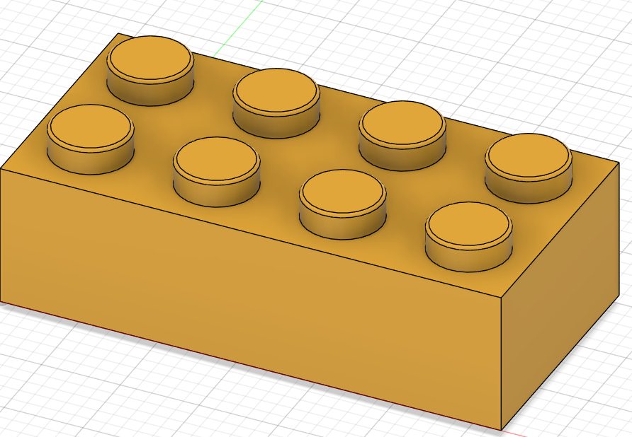
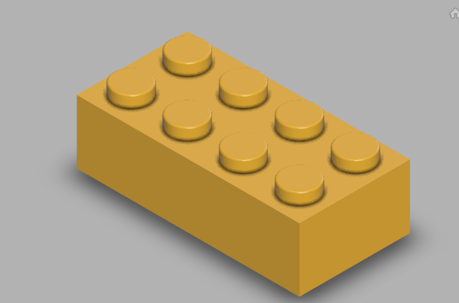

# Day 01 — 2x4 LEGO Brick

> 🎥 YouTube: [Link to this day's video once published]

## Objective
Model a classic 2x4 LEGO brick from scratch in Fusion 360 — a great Day 1 project because it looks simple but actually requires precise, correctly-constrained sketches and consistent circular patterning to get the iconic stud layout right.

## Skills Practiced
- Sketching on the base plane with full dimensional constraints
- Extruding a solid base body
- Creating a single stud (circle sketch + extrude)
- Circular/rectangular patterning to array the studs correctly (2x4 = 8 studs)
- Exporting a finished model to STEP and OBJ for portfolio/sharing use

## CAD Features Used
- Sketch
- Extrude (base block + studs)
- Pattern (Rectangular)
- Fillet (top stud edges, for the realistic rounded look)

## Challenges
Getting the stud spacing and size to actually match real LEGO proportions (rather than an arbitrary grid) was harder than expected — LEGO studs follow a very specific pitch that isn't obvious just by eyeballing a reference image.

## How I Solved Them
Used a reference image of a real brick and the known standard LEGO unit pitch (8mm between stud centers, 4.8mm stud diameter, 1.7mm stud height above the deck) to dimension the first stud sketch precisely, then used a rectangular pattern (2 x 4 grid) driven by that same 8mm spacing so every stud lines up correctly on the first try.

## Engineering Notes
Modeling the stud as its own sketch + extrude (rather than trying to sketch all 8 at once) made the pattern step much simpler and kept the timeline easy to edit later if I want to change the brick size (e.g. to a 2x6 or 1x4 variant).

## Manufacturing Considerations
As modeled, this would be directly 3D-printable (FDM) at a small scale, though real LEGO bricks are precision injection-molded to very tight tolerances (within microns) for their signature "clutch power" friction fit — a detail that's effectively impossible to replicate with a home FDM printer, but good to be aware of as a manufacturing constraint.

## Material Suggestions
ABS or PETG for a 3D-printed version. Genuine LEGO bricks are injection-molded ABS.

## Improvements
Next iteration: add the internal tube/ring structure on the underside of the brick (visible on real LEGO bricks), which is what actually provides the clutch-power friction fit with the studs of a brick below it — the current model has a simple flat underside.

## Time Taken
~1 hour

## Final Images

**Fusion 360 workspace view:**

**Clean render view:**

## Download Files
- [STEP File](./CAD/Model.step)
- [OBJ File](./CAD/Model.obj)

> Note: no native `.f3d` or `.stl` was provided for this day — add them here if you export them later.
