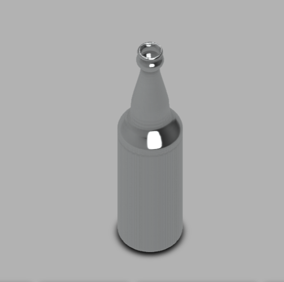

# Day 02 — Glass Beverage Bottle (Surface/Solid Modeling)

> 🎥 YouTube: [Link to this day's video once published]

## Objective
Model a realistic glass beverage bottle in Fusion 360, working from a product reference photo to reverse-engineer proportions — the neck taper, shoulder curve, body profile, and finish (bottle-cap threading area) — that a real bottle actually has.

## Skills Practiced
- Revolve from a single profile sketch (bottles are inherently axisymmetric)
- Constructing a smooth, continuous profile curve using spline/arc geometry rather than straight segments
- Shell (to give the bottle a realistic wall thickness rather than being solid glass)
- Matching proportions against a real-world reference image

## CAD Features Used
- Sketch (profile curve with splines/arcs)
- Revolve
- Shell
- Fillet (base edge and neck opening)

## Challenges
Getting the transition curves (shoulder-to-neck, neck-to-finish) to look smooth and "glass-like" rather than faceted or kinked — small profile sketch errors become very obvious once revolved into a reflective/transparent-looking surface.

## How I Solved Them
Used the product reference image as an underlay/canvas in the sketch, tracing the outer profile with tangent-constrained arcs and splines instead of freehand lines, which kept curvature continuous through the shoulder and neck transitions.

## Engineering Notes
Modeling this as a single revolved profile (rather than a surface loft) was the simpler and more accurate approach here specifically because the bottle is fully axisymmetric — worth remembering that Revolve should be the default choice for any round container/bottle/vessel shape, with surface lofting reserved for genuinely non-axisymmetric organic shapes.

## Manufacturing Considerations
Real glass bottles like this are manufactured by blow molding into a two-part mold, which is why the model's wall thickness was kept uniform via Shell — a mold-based process needs consistent wall thickness to cool and solidify evenly, unlike additive manufacturing where wall thickness is more flexible.

## Material Suggestions
Soda-lime glass, as used in standard commercial beverage bottles. If prototyping in a non-glass material, clear PETG would be the closest visual/print analog.

## Improvements
Add the threaded/lugged finish detail at the neck opening (currently modeled as a simple cylindrical opening) to make the model cap-compatible, and consider adding a slight embossed logo/brand area on the body as a next iteration.

## Time Taken
_Add your actual time here_

## Reference Used
A product photo from ProductDesignOnline.com was used as a visual reference for reverse-engineering the bottle's proportions (see `Reference/reference-photo-productdesignonline.jpg`). This image is **not** original work and is credited here for attribution — it is not one of this project's final images.

## Final Images

**Fusion 360 isometric view:**

_Add front/exploded views to `Images/` and reference them here as you export more angles._

## Download Files
- [STEP File](./CAD/Model.step)
- [OBJ File](./CAD/Model.obj)
- [MTL File](./CAD/Model.mtl)

> Note: no native `.f3d` or `.stl` was provided for this day — add them here if you export them later.
