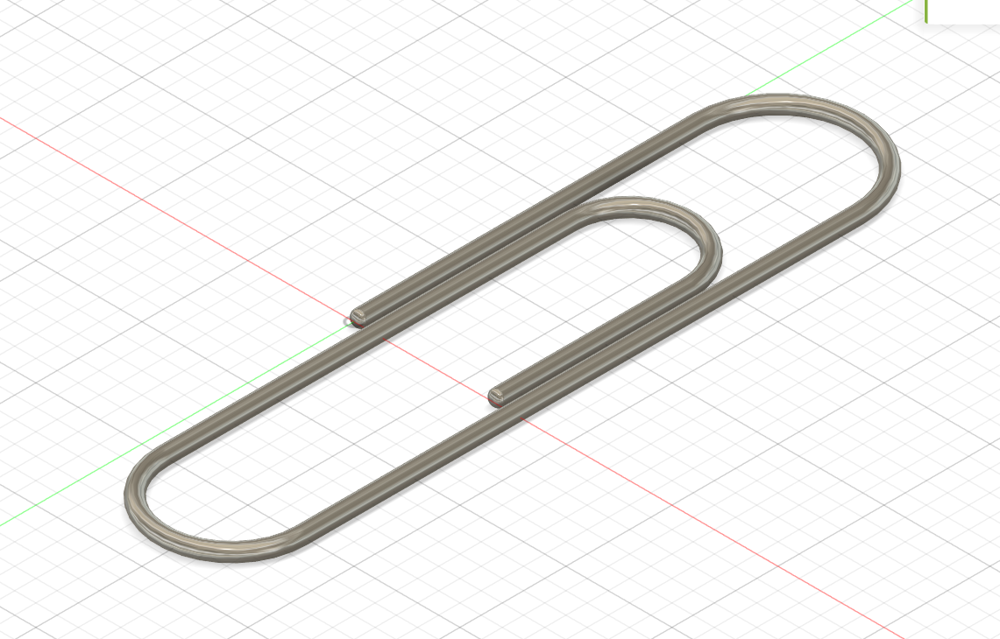
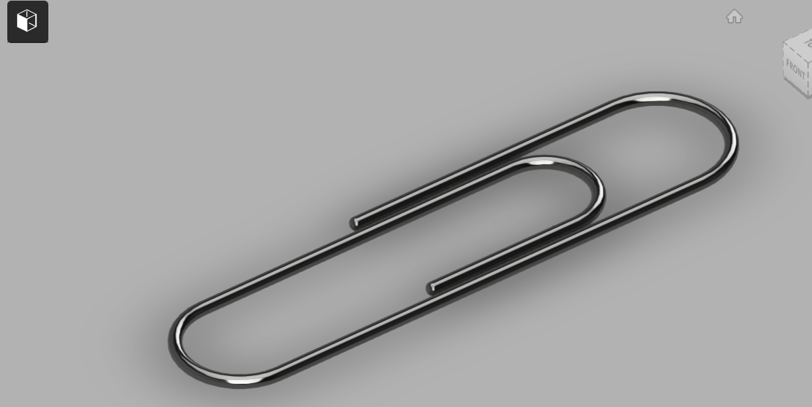

# Day 03 — Standard Paper Clip

> 🎥 YouTube: [Link to this day's video once published]

## Objective
Model a standard double-oval paper clip in Fusion 360, focusing on 3D sketch/spline-based wire modeling rather than the sketch+extrude workflow used in most earlier days — a good exercise in modeling continuously bent wire/rod geometry.

## Skills Practiced
- Sweeping a circular profile along a path (rather than extruding a flat sketch)
- Constructing a smooth open-loop path with consistent bend radii
- Working with a swept solid across multiple direction changes without self-intersection
- Rendering a reflective metallic material to check surface continuity

## CAD Features Used
- Sketch (path curve — the paper clip's characteristic double-loop profile)
- Sweep (circular profile along the path)
- Fillet (subtle edge softening at the wire ends)

## Challenges
Keeping the swept wire from pinching or self-intersecting at the tight inner loop, where the path curvature is sharpest relative to the wire's cross-sectional diameter.

## How I Solved Them
Increased the bend radius at the inner loop slightly beyond a "perfectly sharp" real-world clip so the sweep profile had enough clearance to follow the path without self-intersecting, then compared the result against the reference proportions to make sure it still read as a standard paper clip.

## Engineering Notes
Sweep is the correct tool whenever you're modeling a constant cross-section that follows a path — trying to do this with extrude/loft instead (like I did for earlier days) would have required an unreasonable number of intermediate profiles to get the same smooth, continuously-curved result.

## Manufacturing Considerations
Real paper clips are made by bending a single continuous length of spring steel wire on an automated bending machine — there's no molding or machining involved, which is very different from every other Day so far in this challenge. The model's constant circular cross-section throughout reflects that it's formed from a single wire of uniform diameter.

## Material Suggestions
Spring steel wire (often galvanized or nickel-plated) for a real paper clip. If 3D printing a display version, PLA/PETG would work but obviously wouldn't have the springy clutch behavior of the real thing.

## Improvements
Add slight material spring-back/asymmetry to make the model look less "perfectly CAD" and more like an actual bent-wire part, and consider modeling a second variant (e.g. a jumbo or triangular clip) to compare proportions.

## Time Taken
_Add your actual time here_

## Final Images

**Fusion 360 workspace view:**

**Clean render view:**

## Download Files
- [STEP File](./CAD/Model.step)
- [OBJ File](./CAD/Model.obj)
- [MTL File](./CAD/Model.mtl)

> Note: no native `.f3d` or `.stl` was provided for this day — add them here if you export them later.
