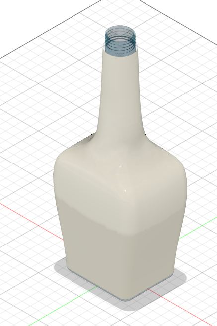
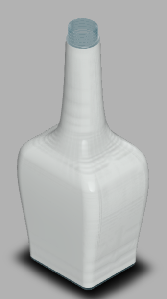

# Day 04 — Complex Glass Bottle (Square-to-Round Body with Threaded Neck)

> 🎥 YouTube: [Link to this day's video once published]

## Objective
Push beyond Day 2's simple axisymmetric bottle by modeling a more complex bottle shape — a square-ish base that transitions into a rounded shoulder and neck, finished with a modeled threaded opening for a screw cap.

## Skills Practiced
- Lofting between dissimilar profiles (square base → circular shoulder/neck)
- Modeling a helical thread feature (Coil/Thread tool) on the bottle finish
- Shell (uniform wall thickness for a hollow bottle body)
- Fillet (softening the square base's vertical edges into the rounded transition)

## CAD Features Used
- Sketch (square base profile, circular neck profile)
- Loft (square-to-round body transition)
- Revolve or additional Loft (neck/shoulder taper)
- Thread tool (helical thread geometry at the bottle opening)
- Shell
- Fillet

## Challenges
Getting a clean, non-pinched loft between a square profile and a circular profile — unlike Day 2's bottle where every cross-section was circular, this transition has genuinely different profile *shapes*, not just different sizes of the same shape.

## How I Solved Them
Added an intermediate guide profile partway up the transition (a rounded-square shape) so the loft had a smoother path to interpolate through, rather than jumping directly from a sharp-cornered square to a perfect circle in one step — this avoided the pinching/twisting that a direct two-profile loft produced on the first attempt.

## Engineering Notes
This project reinforced that loft feasibility depends heavily on how different the start and end profiles are — small profile changes loft cleanly with just two profiles, but a square-to-circle transition needed at least one intermediate "compromise" profile to guide the surface smoothly. The threaded neck was also a good exercise in using Fusion's dedicated Thread tool rather than trying to model helical geometry manually with a swept sketch.

## Manufacturing Considerations
Like Day 2's bottle, this would realistically be manufactured by blow molding into a two-part (or multi-part, given the square base) mold — the square-to-round transition and consistent wall thickness (via Shell) were both modeled with that process in mind, since blow molding needs a mold that can release the part cleanly and a wall thickness that cools evenly.

## Material Suggestions
Soda-lime glass for a real bottle. Clear or frosted PETG would be the closest visual match for a 3D-printed prototype, though the fine thread detail would likely need to be printed at a larger scale or post-machined to function properly with a real cap.

## Improvements
Refine the square-to-round transition to more closely match commercial bottle proportions (the current shoulder curve is a first-pass approximation), and add a slight taper/draft angle to the square base to better reflect real mold-release requirements.

## Time Taken
_Add your actual time here_

## Final Images

**Fusion 360 workspace view:**

**Clean render view:**

## Download Files
- [STEP File](./CAD/Model.step)
- [OBJ File](./CAD/Model.obj)
- [MTL File](./CAD/Model.mtl)

> Note: no native `.f3d` or `.stl` was provided for this day — add them here if you export them later.
