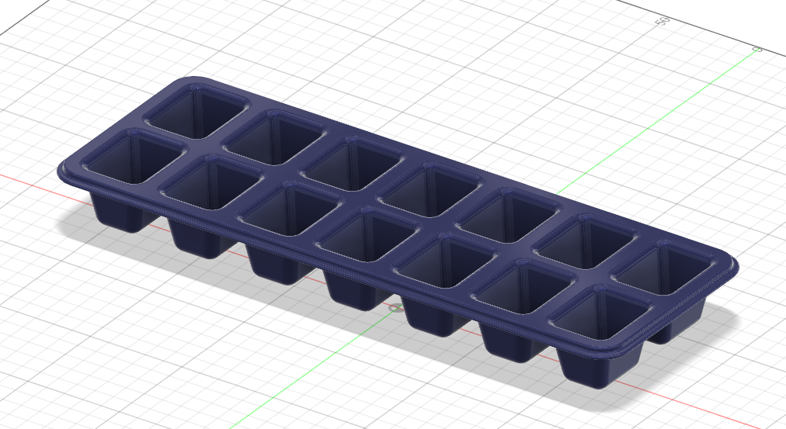
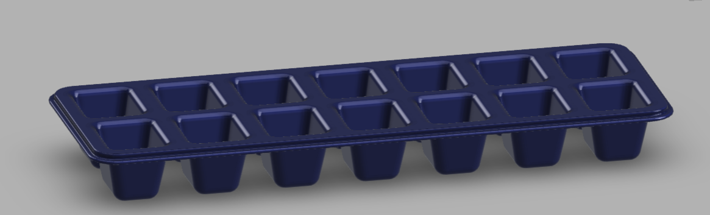
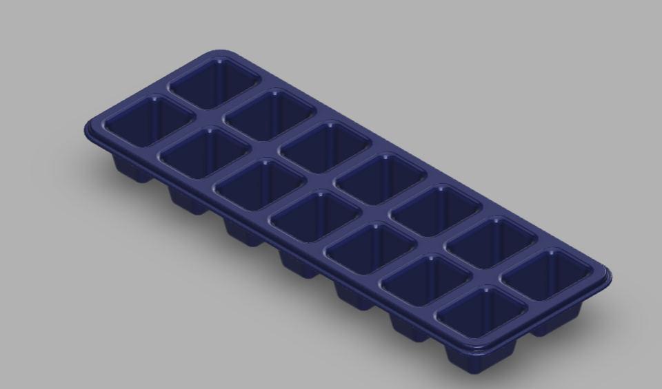

# Day 05 — 14-Cavity Ice Cube Tray

> 🎥 YouTube: [Link to this day's video once published]

## Objective
Model a 14-cavity ice cube tray, focusing on patterning a single tapered cavity feature across a grid and getting the draft angles right so the part would actually be moldable/de-moldable in real manufacturing.

## Skills Practiced
- Sketch (single cavity profile with draft/taper built in)
- Extrude Cut (single cavity)
- Rectangular Pattern (arraying the cavity 2 rows x 7 columns = 14 cavities)
- Fillet (softening cavity edges and tray rim)
- Shell or wall-thickness-aware cavity depth control

## CAD Features Used
- Sketch
- Extrude (Cut, for the cavities; base extrude for the tray body)
- Rectangular Pattern
- Fillet

## Challenges
Getting consistent draft angle on every cavity wall so cubes would actually pop out of a real mold (or a real silicone/plastic tray) — a cavity with vertical (0° draft) walls looks fine in CAD but would be very difficult to demold or release ice from in reality.

## How I Solved Them
Built the single cavity profile with a deliberate taper (narrower at the bottom, wider at the top) from the very first sketch rather than trying to add draft afterward, then patterned that already-tapered feature across the grid — this guaranteed every cavity had identical, correct draft by construction rather than needing 14 individual fixes.

## Engineering Notes
Doing the draft angle *before* patterning (not after) was the key lesson here — patterning a feature that already has the right geometry is trivial, but trying to retroactively add draft to 14 already-patterned cavities would have meant editing the pattern's source feature anyway, so building it right the first time saved a redo.

## Manufacturing Considerations
Real ice trays like this are typically injection molded (rigid plastic) or compression/injection molded (silicone) — both processes require draft angles on every vertical face to allow the part to release from the mold cleanly, which is exactly why the cavity taper wasn't just a stylistic choice but a functional requirement modeled from the start.

## Material Suggestions
Food-grade silicone (flexible, easy ice release by twisting) or food-grade polypropylene (rigid, traditional ice-tray material) would both be realistic choices depending on whether a flexible or rigid tray is intended.

## Improvements
Add a slight lip/pour spout at one end for easier water filling, and consider rounding the cavity bottoms (currently flat) to better match how consumer ice trays are usually shaped for easier ice release.

## Time Taken
_Add your actual time here_

## Final Images

**Fusion 360 workspace view:**

**Clean render views:**

## Download Files
- [STEP File](./CAD/Model.step)
- [OBJ File](./CAD/Model.obj)
- [MTL File](./CAD/Model.mtl)

> Note: no native `.f3d` or `.stl` was provided for this day — add them here if you export them later.
