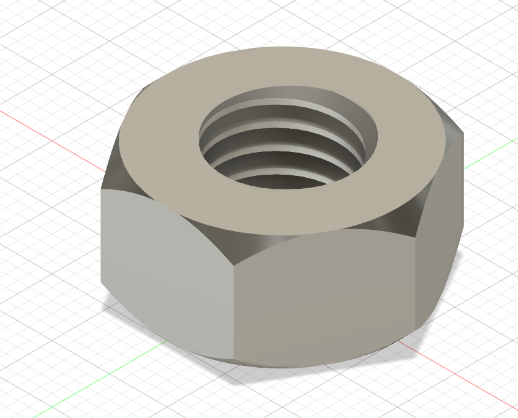
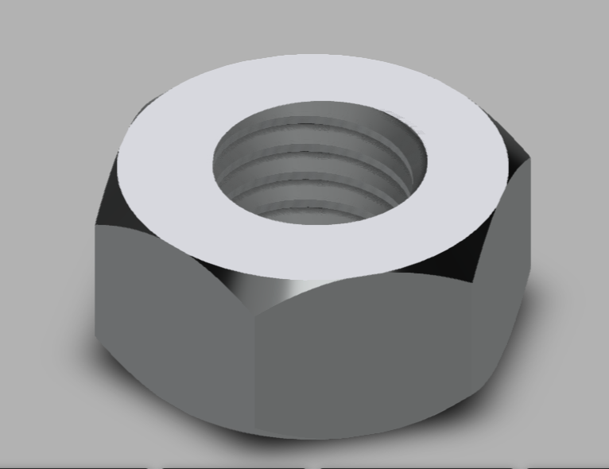

# Day 06 — Standard Hex Nut

> 🎥 YouTube: [Link to this day's video once published]

## Objective
Model a standard hexagonal nut with a modeled internal thread, following real fastener proportions (across-flats width, thickness, thread pitch) rather than an arbitrary hex shape.

## Skills Practiced
- Sketch (hexagon profile using the polygon tool)
- Extrude (hex body)
- Thread tool (internal helical thread)
- Chamfer (the characteristic angled bevel on a hex nut's top/bottom face edges)

## CAD Features Used
- Sketch (polygon, circle for the bore)
- Extrude
- Thread (internal, standard metric or ISO thread callout)
- Chamfer

## Challenges
Getting the chamfered bevel around the top and bottom hex edges to look correct — real hex nuts have a distinctive angled "washer face" bevel where the hex corners are chamfered down to meet the circular bearing face, which is a slightly different geometry than a simple uniform edge chamfer.

## How I Solved Them
Used Fusion's Chamfer tool with a distance-and-angle setting on the top/bottom hex edges (rather than a simple equal-distance chamfer), matching the bevel angle typically seen on real hex nuts, which produced the correct tapered look where the hex corners blend into the circular top face.

## Engineering Notes
Using Fusion's built-in Thread tool (rather than manually modeling helical geometry) meant I could select a standard thread callout directly, which keeps the model dimensionally consistent with real off-the-shelf fastener sizes instead of an arbitrary custom thread.

## Manufacturing Considerations
Real hex nuts are typically cold-formed (forged) from steel bar stock and then tapped for the internal thread — a fundamentally different process from injection molding or 3D printing, so if this were 3D printed as a display piece, the modeled thread would likely need to be printed oversized or the hole left unthreaded and tapped afterward, since FDM printing struggles with fine internal threads at small scale.

## Material Suggestions
Steel (grade 8 or stainless) for a functional fastener. For a display/portfolio print, PLA or PETG would work visually but wouldn't hold up under real clamping load.

## Improvements
Add a matching bolt to pair with this nut (similar to the Day-04 Nut & Bolt Assembly project) to show the two mating parts together, and consider modeling a nylon-insert (nyloc) variant as a variation.

## Time Taken
_Add your actual time here_

## Final Images

**Fusion 360 workspace view:**

**Clean render view:**

## Download Files
- [STEP File](./CAD/Model.step)
- [OBJ File](./CAD/Model.obj)
- [MTL File](./CAD/Model.mtl)

> Note: no native `.f3d` or `.stl` was provided for this day — add them here if you export them later.
