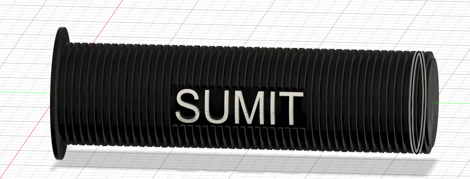
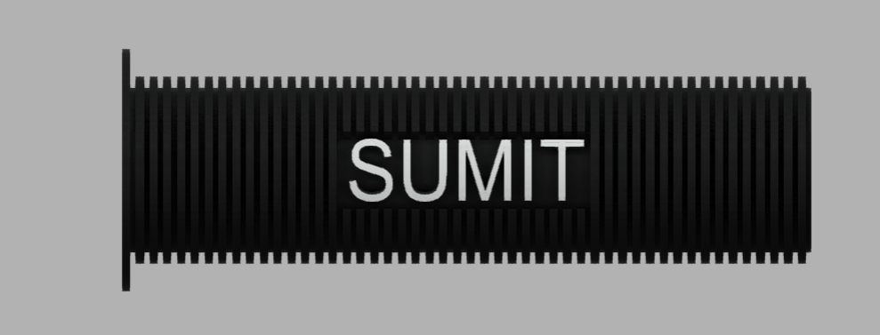
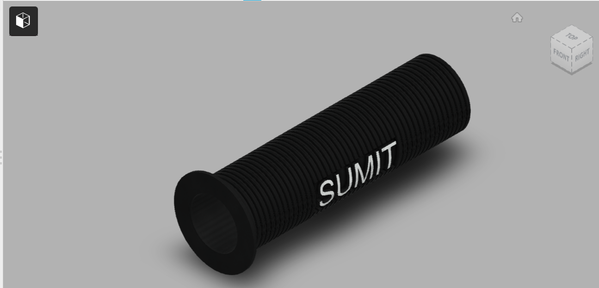

# Day 07 — Personalized Bike Handlebar Grip

> 🎥 YouTube: [Link to this day's video once published]

## Objective
Model a ribbed bicycle handlebar grip with a personalized embossed name ("SUMIT") on the surface — combining a repeating rib pattern for real-world grip texture with 3D text embossing, both wrapped around a cylindrical tube.

## Skills Practiced
- Sketch (single rib profile + text sketch)
- Revolve or Extrude (base tube body)
- Circular/Rectangular Pattern (repeating the rib feature along the tube length)
- Emboss / 3D text on a curved (cylindrical) surface
- Shell (hollow tube wall for a real grip that slides onto a handlebar)

## CAD Features Used
- Sketch
- Revolve (base cylindrical tube)
- Extrude Cut or Rib pattern (the ribbed grip texture)
- Pattern (repeating ribs along the length)
- Emboss (wrapping "SUMIT" text onto the curved surface)
- Shell

## Challenges
Getting the embossed text to wrap correctly and legibly onto a curved cylindrical surface — text that looks fine on a flat sketch can distort or become hard to read once projected/embossed onto a curve, especially at the edges of the lettering.

## How I Solved Them
Used Fusion's Emboss feature (rather than trying to manually sketch each letter on the curved face) and centered the text sketch on the tube's flattened mid-section rib area, which kept the letterforms undistorted since Emboss projects the profile onto the surface rather than requiring it to be pre-warped.

## Engineering Notes
Modeling this as a hollow tube (via Shell) rather than a solid cylinder was important for realism — a real handlebar grip needs to be hollow to actually slide onto and grip a handlebar tube, so wall thickness and inner diameter both needed to reflect that functional requirement, not just look right from the outside.

## Manufacturing Considerations
Real bike grips like this are typically injection molded or extruded in a flexible rubber/foam material, and the ribbed texture is functional (improves hand grip and shock absorption) as well as decorative — both the rib pattern and personalized text would need to be part of the mold cavity itself in a real production process.

## Material Suggestions
TPU (thermoplastic polyurethane) or rubber for a real, flexible grip. TPU is also a realistic 3D-printing material choice if printing a functional (rather than purely display) version, since it retains some flexibility unlike rigid PLA/PETG.

## Improvements
Add flared/flanged ends (there's already a slight flange visible at one end) consistently at both ends for a more complete, symmetric grip design, and consider varying rib spacing/depth to fine-tune the actual grip texture.

## Time Taken
_Add your actual time here_

## Final Images

**Fusion 360 workspace view:**

**Clean render views:**

## Download Files
- [STEP File](./CAD/Model.step)
- [OBJ File](./CAD/Model.obj)
- [MTL File](./CAD/Model.mtl)

> Note: no native `.f3d` or `.stl` was provided for this day — add them here if you export them later.
