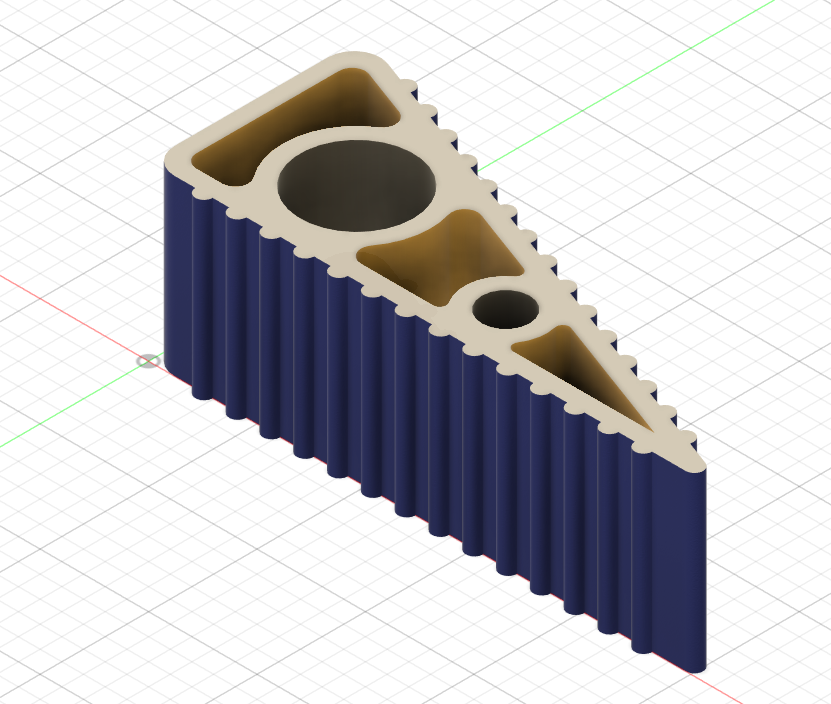

# Day 08 — Wedge Door Stopper

> 🎥 YouTube: [Link to this day's video once published]

## Objective
Model a wedge-shaped door stopper with a ribbed/toothed grip edge (for traction against the floor and door) and multiple internal cutouts of varying sizes — a good exercise in combining a non-rectangular extrude profile with several different cut feature types in one part.

## Skills Practiced
- Sketch (triangular/wedge profile)
- Extrude (base wedge body)
- Rectangular/linear Pattern (repeating the ridged tooth profile along the sloped grip edge)
- Extrude Cut (multiple different-sized and different-shaped through-cutouts — circular and blended/rounded profiles)
- Fillet (softening body edges)

## CAD Features Used
- Sketch (wedge triangle profile, tooth profile, cutout profiles)
- Extrude (base body + cuts)
- Pattern (ridged edge teeth)
- Fillet

## Challenges
Balancing the size and placement of the internal cutouts (circular and rounded-triangular shapes) against wall thickness — cutting too much material out of a wedge this size risks weakening the part exactly where it needs to resist compression force from a door pushing against it.

## How I Solved Them
Kept a consistent minimum wall thickness around every cutout by sketching reference offset curves before placing each hole, rather than eyeballing hole sizes directly against the outer wedge profile — this made sure no cutout got placed too close to an outer face.

## Engineering Notes
The ridged/toothed edge along the sloped face is functionally important, not just decorative — it's what gives a real door stopper grip against smooth flooring under the sideways load a door applies, so that pattern was placed deliberately along the ground-contact edge rather than symmetrically around the whole part.

## Manufacturing Considerations
Real wedge door stoppers like this are usually injection molded in a flexible or semi-rigid rubber/plastic, which is also why the internal cutouts make sense here — reducing material use and molding cycle time (thinner sections cool faster) while the ridged face still needs to stay solid enough to grip the floor.

## Material Suggestions
TPU or rubber for real-world floor grip and impact resistance. PLA or PETG would work for a rigid 3D-printed version, though it would be more prone to sliding on smooth floors without the flexibility of rubber.

## Improvements
Round or chamfer the transition between the ridged grip face and the smooth faces for a more finished look, and consider adding a small handle/finger cutout at the tall end for easier removal from under a door.

## Time Taken
_Add your actual time here_

## Final Images

**Fusion 360 workspace view:**

## Download Files
- [STEP File](./CAD/Model.step)
- [OBJ File](./CAD/Model.obj)
- [MTL File](./CAD/Model.mtl)

> Note: no native `.f3d` or `.stl` was provided for this day — add them here if you export them later. Only one image was provided for this day; add front/exploded views to `Images/` if you export more angles.
