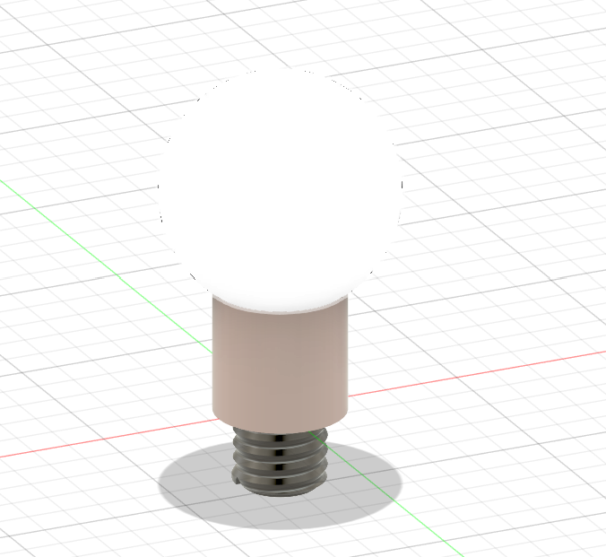
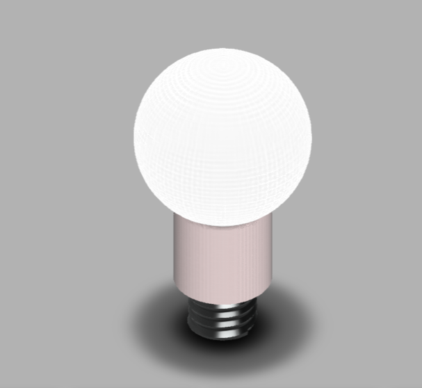
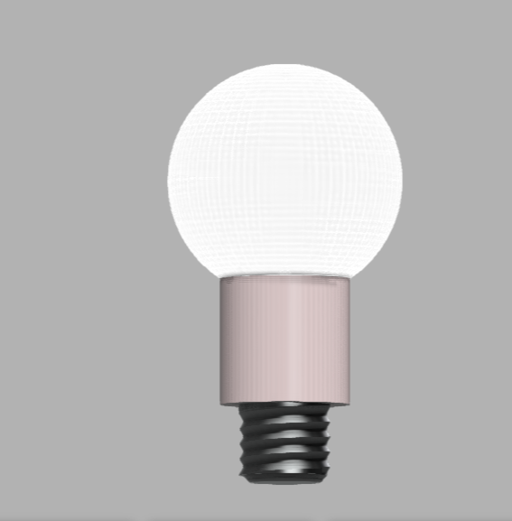

# Day 09 — Standard Light Bulb (E27/E26 Base)

> 🎥 YouTube: [Link to this day's video once published]

## Objective
Model a classic round light bulb — a spherical glass envelope on a cylindrical neck with a threaded Edison screw base — combining smooth organic revolve geometry with a precise, standards-based threaded connector.

## Skills Practiced
- Revolve (spherical bulb envelope and cylindrical neck as a single axisymmetric profile)
- Thread tool (Edison screw base — E26/E27 standard thread)
- Appearance/material assignment (frosted glass vs. matte metal base) to visually distinguish functional zones
- Working to a real component standard (Edison base) rather than an arbitrary thread

## CAD Features Used
- Sketch (bulb profile — sphere-to-cylinder transition curve)
- Revolve (entire bulb body from one profile)
- Thread (Edison screw base, standard callout)
- Appearance assignment (frosted white glass, ceramic/ivory neck, dark metal base)

## Challenges
Getting the transition from the spherical glass envelope into the straight cylindrical neck to read as one continuous, smooth surface rather than showing a visible kink where the two geometries meet.

## How I Solved Them
Used tangent constraints between the spherical arc and the straight neck line in the profile sketch before revolving, which forced the solver to keep the curvature continuous through the transition rather than leaving a sharp, visually obvious seam.

## Engineering Notes
Modeling the Edison screw base to the actual E26/E27 standard (rather than a generic thread) means this part's base geometry would genuinely mate with a real lamp socket — a good reminder that "looks right" and "is dimensionally correct to a standard" are different bars, and the second one is what actually matters if a part needs to interface with real hardware.

## Manufacturing Considerations
Real bulbs like this combine multiple materials and processes in one assembly — blown/molded glass for the envelope, stamped/rolled metal for the threaded base, and a ceramic or plastic insulating neck — so while this model is a single solid body for simplicity, a real production version would be assembled from at least three separately manufactured parts.

## Material Suggestions
Frosted/opal glass for the envelope, brass or nickel-plated steel for the Edison base, and ceramic or thermoplastic for the insulating neck collar — modeled here via appearance assignment even though it's one solid body.

## Improvements
Split the model into separate glass/base/neck bodies or components (matching how a real bulb assembles) so each part could carry its own accurate material and wall thickness, and consider adding an internal filament/LED representation for a more complete visual.

## Time Taken
_Add your actual time here_

## Final Images

**Fusion 360 workspace view:**

**Clean render views:**

## Download Files
- [STEP File](./CAD/Model.step)
- [OBJ File](./CAD/Model.obj)
- [MTL File](./CAD/Model.mtl)

> Note: no native `.f3d` or `.stl` was provided for this day — add them here if you export them later.
