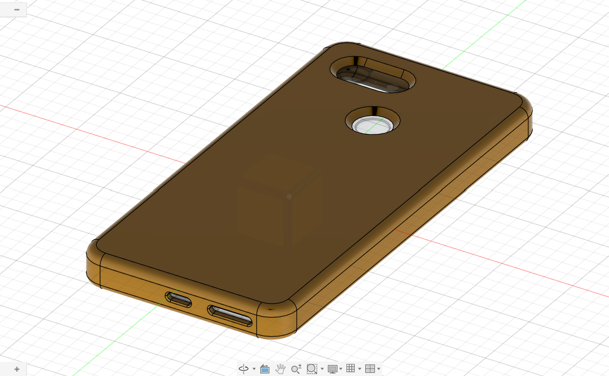
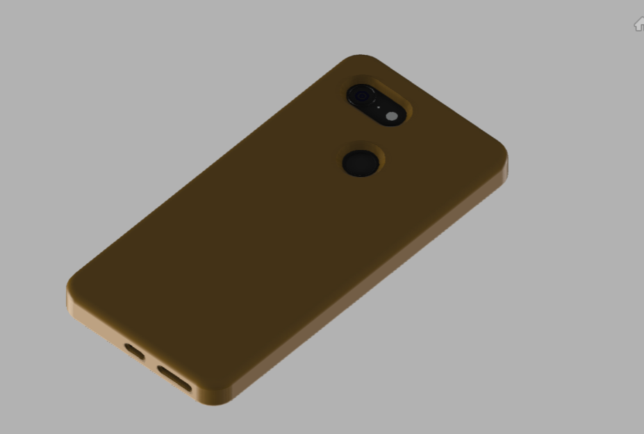

# Day 10 — Google Pixel 3 Phone Case

> 🎥 YouTube: [Link to this day's video once published]

## Objective
Design a form-fitting protective case for a Google Pixel 3, working from a reference phone model to get precise cutout placement (camera, flash, fingerprint sensor, USB-C port, speaker grilles) rather than an approximate generic shape.

## Skills Practiced
- Reverse engineering / dimensioning from a reference model
- Sketch (case outline offset from the phone body)
- Shell (thin-walled protective shell around the phone body)
- Multiple precisely-located Extrude Cuts (camera bump, flash, fingerprint sensor, port, speaker openings)
- Fillet (rounded case corners and edges for both aesthetics and drop protection)

## CAD Features Used
- Sketch (case outline, cutout profiles)
- Shell (case wall thickness)
- Extrude Cut (camera/flash/sensor/port openings)
- Fillet

## Challenges
Getting every cutout (camera module, flash, fingerprint sensor, USB-C port, and both speaker/mic openings) positioned precisely enough to align with the reference phone's actual geometry — even a millimeter of misalignment on a cutout like the camera ring makes the case look and fit wrong.

## How I Solved Them
Used the reference Pixel 3 model directly as a positioning guide inside the same Fusion 360 file (as a reference/canvas body, not merged into the final part), projecting its key feature edges onto my case sketches so every cutout was located from the phone's actual geometry rather than from estimated measurements.

## Engineering Notes
Designing a case by referencing the actual device geometry (rather than working from photos or written dimensions) is much closer to how real accessory manufacturers work — it's the difference between "looks about right" and a case that will actually snap on and align correctly with a real device's ports and camera module.

## Manufacturing Considerations
Real phone cases like this are typically injection molded in a flexible material (TPU) for shock absorption, sometimes combined with a rigid polycarbonate back — the shell wall thickness modeled here would need to stay within a narrow range: thick enough for drop protection, thin enough to not make the phone bulky or block wireless charging.

## Material Suggestions
TPU for drop protection and flexibility (needed to stretch the case on/off the phone), or a two-material combination of rigid polycarbonate back + TPU bumper edges for a hybrid protective case.

## Improvements
Add raised edges around the screen face (to protect the display when set face-down) and a slightly raised lip around the camera module (to protect the lens from scratches when the phone is set on a flat surface) — both common features on production phone cases that this first pass doesn't yet include.

## Time Taken
_Add your actual time here_

## Reference Used
A reference Google Pixel 3 phone model (`Reference/Reference-Google-Pixel-3.stp`) was used to accurately position case cutouts and verify fit — this reference model is **not** original work for this project and is credited here for attribution; it is not one of this project's final deliverables.

## Final Images

**Fusion 360 workspace view:**

**Clean render view:**

## Download Files
- [STEP File](./CAD/Model.step)
- [OBJ File](./CAD/Model.obj)
- [MTL File](./CAD/Model.mtl)

> Note: no native `.f3d` or `.stl` was provided for this day — add them here if you export them later.
