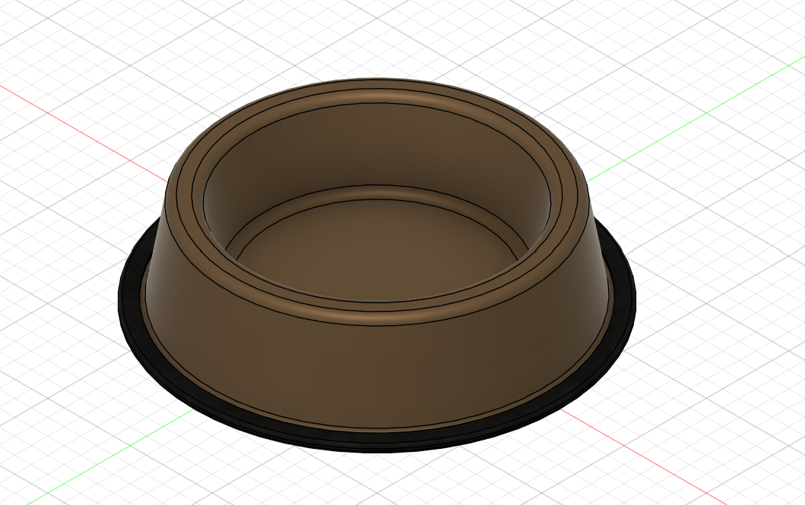
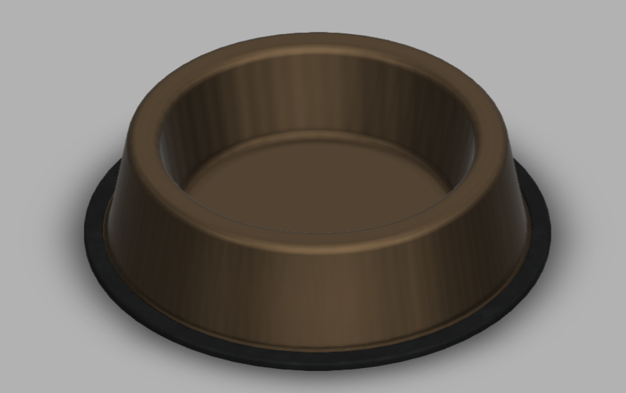

# Day 11 — Non-Slip Pet Food Bowl

> 🎥 YouTube: [Link to this day's video once published]

## Objective
Model a two-part pet food bowl — a rigid main bowl body plus a separate rubber non-slip base ring — practicing multi-body/multi-material product design rather than a single-material part.

## Skills Practiced
- Revolve (axisymmetric bowl profile)
- Shell (hollow bowl interior with controlled wall thickness)
- Multi-body modeling (bowl body + separate base ring as distinct bodies/components)
- Appearance assignment to visually differentiate materials (metal/ceramic bowl vs. rubber base)

## CAD Features Used
- Sketch (bowl profile, base ring profile)
- Revolve (bowl body, base ring)
- Shell
- Fillet (rim and base edges)
- Appearance assignment

## Challenges
Sizing the rubber base ring so it wraps the bowl's lower edge convincingly (like a real anti-slip silicone base) without simply looking like a flat disc stuck underneath — getting the ring's cross-section profile to actually hug the bowl's curved lower body.

## How I Solved Them
Sketched the base ring's profile directly against a projected reference of the bowl's lower curve (rather than an arbitrary rectangle), so the ring's inner surface matched the bowl's actual curvature and sat flush against it, the way a real molded silicone sleeve would.

## Engineering Notes
Treating the bowl and base ring as two separate bodies (rather than one fused shape) reflects how this product is actually manufactured and assembled in real life — a rigid bowl material (steel/ceramic) paired with a separately molded rubber ring means each part can use the material best suited to its job: food-safe rigidity for the bowl, grip and shock absorption for the base.

## Manufacturing Considerations
The bowl body would realistically be spun/stamped metal or slip-cast ceramic, while the base ring would be injection-molded silicone or rubber — two different manufacturing processes for two different parts that are assembled (likely press-fit or adhesive-bonded) rather than made as a single piece.

## Material Suggestions
Stainless steel or ceramic for the bowl body (food-safe, easy to clean, durable), and silicone rubber for the non-slip base ring (grip, some give for stability on hard floors).

## Improvements
Add a slight inward lip at the bowl rim to reduce food/water spillage, and consider a raised pattern or texture on the base ring's underside to further improve floor grip beyond just the material choice.

## Time Taken
_Add your actual time here_

## Final Images

**Fusion 360 workspace view:**

**Clean render view:**

## Download Files
- [STEP File](./CAD/Model.step)
- [OBJ File](./CAD/Model.obj)
- [MTL File](./CAD/Model.mtl)

> Note: no native `.f3d` or `.stl` was provided for this day — add them here if you export them later.
