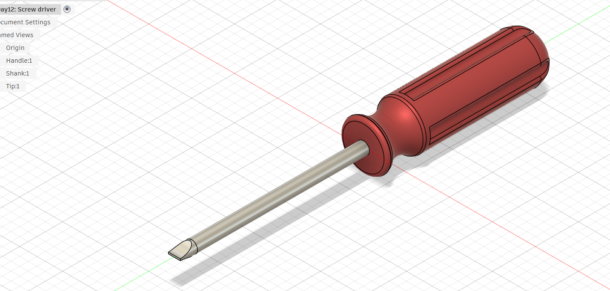

# Day 12 — Screwdriver

> 🎥 YouTube: [Link to this day's video once published]

## Objective
Model a fully assembled flathead screwdriver, combining multiple components (handle, shank, and tip) into one cohesive part with distinct materials for each section.

## Skills Practiced
- Multi-body modeling within a single part (Handle, Shank, Tip as separate bodies)
- Revolve feature for the cylindrical handle and shank
- Surface ribbing pattern along a curved body for grip texture
- Material assignment per body (rubber/plastic handle, metal shank and tip)
- Blending organic ergonomic shapes with precise mechanical geometry

## CAD Features Used
Revolve, Sweep, Circular Pattern, Fillet, Chamfer, Appearance/Material assignment

## Challenges
- Getting the ribbing pattern on the handle to wrap cleanly and stay evenly spaced along the curved profile.
- Aligning the shank and tip so the flathead bevel sits centered and symmetric.
- Balancing an ergonomic, rounded handle silhouette with the more rigid, functional geometry of the shank and tip.

## How I Solved Them
Used a circular pattern constrained to the handle's revolve axis to keep the ribbing evenly spaced, and built the tip as a separate sketch profile revolved and then chamfered to get a clean symmetric flathead bevel.

## Engineering Notes
Modeled the handle, shank, and tip as separate bodies within one part file to keep materials and future edits independent, rather than a single continuous body.

## Manufacturing Considerations
Handle would typically be injection-molded (rubber/TPE over a plastic or metal core); shank and tip machined or cold-formed from tool steel. As modeled, the geometry is compatible with both 3D printing (multi-material or single-material approximation) and traditional manufacturing.

## Material Suggestions
- Handle: TPE / rubberized plastic
- Shank: Chrome-vanadium or tool steel
- Tip: Hardened tool steel

## Improvements
Could add a hex bolster near the tip for wrench grip, and refine the handle taper for a more ergonomic profile.

## Time Taken
_Approx. time spent modeling today._

## Final Images
| View | Preview |
|---|---|
| Isometric View |  |

## Download Files
- [STEP File](./CAD/Model.step)
- [OBJ File](./CAD/Model.obj)
- [MTL File](./CAD/Model.mtl)
