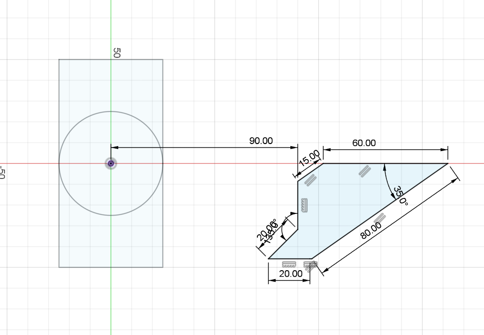

# Day 13 — Sketch Constraint Practice

> 🎥 YouTube: [Link to this day's video once published]

## Objective
Practice fully constraining 2D sketches using a mix of dimensional and geometric constraints — no 3D modeling today, purely sketch discipline.

## Skills Practiced
- Dimensional constraints (linear, angular)
- Geometric constraints (concentric, tangent, parallel, perpendicular)
- Constructing a rectangle with a fully concentric inscribed circle
- Building an irregular multi-angle polygon from mixed length and angle dimensions
- Getting a sketch to fully-constrained (no under/over-defined geometry)

## CAD Features Used
Sketch, Dimension (linear + angular), Geometric Constraints (concentric, parallel, perpendicular), Construction Geometry

## Challenges
- Fully constraining the multi-angle polygon (90 / 60 / 15 / 80 / 20 mm sides with 20°, 130°, and 35° angles) without over-constraining or leaving DOF unresolved.
- Getting the circle centered exactly on the rectangle's center point rather than eyeballing it.

## How I Solved Them
Added geometric constraints first (concentric point-to-point for the circle, parallel/perpendicular for the rectangle edges) before applying dimensions, so the sketch resolved cleanly rather than fighting between over-defined and under-defined states. Worked through the polygon one angle/length at a time, checking the constraint count against DOF after each addition.

## Engineering Notes
This day was a pure sketch-discipline exercise — the goal wasn't a finished part but a fully and cleanly constrained profile, which is the foundation every solid model in this portfolio depends on.

## Manufacturing Considerations
N/A — sketch-only exercise, no solid body produced today.

## Material Suggestions
N/A

## Improvements
Could practice deriving the same polygon using fewer total constraints (relying more on symmetry/pattern constraints where geometry allows).

## Time Taken
_Approx. time spent modeling today._

## Final Images
| View | Preview |
|---|---|
| Sketch View |  |

## Download Files
- [STEP File](./CAD/Model.step)
