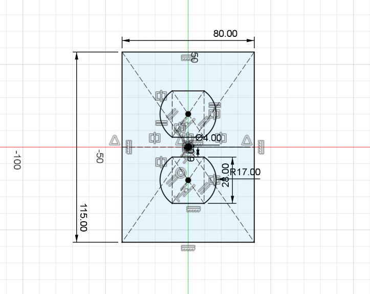

# Day 14 — Sketch Constraint Practice II

> 🎥 YouTube: [Link to this day's video once published]

## Objective
Continue building sketch constraint discipline — this time focused on symmetry, pattern relationships, and mixing circular/polygon geometry within a single fully-defined sketch.

## Skills Practiced
- Symmetric constraint (mirroring the two hexagon/circle clusters about the horizontal center line)
- Concentric constraint (circle centered inside each hexagon)
- Equal constraint (keeping both hexagon/circle clusters identical in size)
- Point-to-point distance dimensioning from a shared center point
- Working with a mix of construction geometry (centerlines) and profile geometry in one sketch

## CAD Features Used
Sketch, Dimension (linear + radial + diameter), Geometric Constraints (symmetric, concentric, equal), Construction Geometry

## Challenges
- Getting both hexagon/circle clusters to stay symmetric about the center line without over-constraining the sketch.
- Placing the small Ø4 center hole exactly on the shared center point between both clusters.
- Balancing the R17 hexagon size and its enclosed circle so they stayed concentric through edits.

## How I Solved Them
Used a horizontal construction centerline through the sketch origin, then applied a symmetric constraint across it for the two hexagon clusters, followed by an equal constraint so editing one automatically updated the other. The center Ø4 hole was placed via a point-to-point dimension referencing the sketch origin rather than eyeballed.

## Engineering Notes
This exercise reinforced designing symmetric features off a single reference/centerline rather than dimensioning each side independently — a pattern that scales much better once a sketch needs to be edited later.

## Manufacturing Considerations
N/A — sketch-only exercise, no solid body produced today.

## Material Suggestions
N/A

## Improvements
Could explore using an actual mirror feature (rather than a symmetric constraint) to compare how Fusion 360 handles editability differently between the two approaches.

## Time Taken
_Approx. time spent modeling today._

## Final Images
| View | Preview |
|---|---|
| Sketch View |  |

## Download Files
- [STEP File](./CAD/Model.step)

## Reference
Practice sketch adapted from a sketch-constraint worksheet (ProductDesignOnline.com), included in [`Drawings/`](./Drawings/) for reference.
