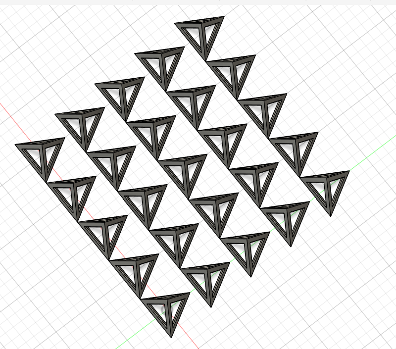
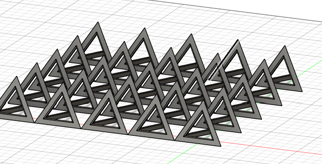

# Day 15 — Painter's Tripod (Batch Print Array)

> 🎥 YouTube: [Link to this day's video once published]

## Objective
Design a single triangular tripod frame component, then pattern it into a full grid array optimized for printing many copies in a single 3D print job.

## Skills Practiced
- Triangular truss/frame sketching with internal open webbing (hollow triangle profile)
- Extrude with shell/open-frame geometry rather than a solid body
- Rectangular pattern across two axes to array a single component into a full print-bed layout
- Designing with build-plate real estate and print efficiency in mind, not just single-part geometry

## CAD Features Used
Sketch, Extrude, Shell/Open Profile, Rectangular Pattern (2-axis)

## Challenges
- Keeping consistent spacing between each tripod unit in the array so they don't touch or overlap on the print bed.
- Making sure the rectangular pattern stayed parametric — editing the single source tripod should update every instance in the grid.

## How I Solved Them
Built and fully validated one tripod unit first, then applied a 2-axis rectangular pattern referencing that single feature, with spacing set as a parameter so the whole grid's density can be tuned from one value.

## Engineering Notes
Designed around practical batch 3D printing — multiple identical small parts (like painter's tripod feet/legs) are often more efficient to print together in one job rather than one at a time, so the array itself was treated as part of the design problem, not just a display arrangement.

## Manufacturing Considerations
Intended for FDM 3D printing. Open triangular frame minimizes material use and print time per unit while keeping the tripod structurally sound. Spacing between units in the array should account for printer nozzle clearance and any brim/skirt settings.

## Material Suggestions
PLA or PETG — sufficient rigidity for a lightweight painter's tripod frame without needing engineering-grade plastics.

## Improvements
Could parametrize wall thickness and add a interlocking/snap-fit detail so each printed frame connects directly into a full tripod assembly without extra fasteners.

## Time Taken
_Approx. time spent modeling today._

## Final Images
| View | Preview |
|---|---|
| Isometric View — Angle 1 |  |
| Isometric View — Angle 2 |  |

## Download Files
- [STEP File](./CAD/Model.step)
- [OBJ File](./CAD/Model.obj)
- [MTL File](./CAD/Model.mtl)
