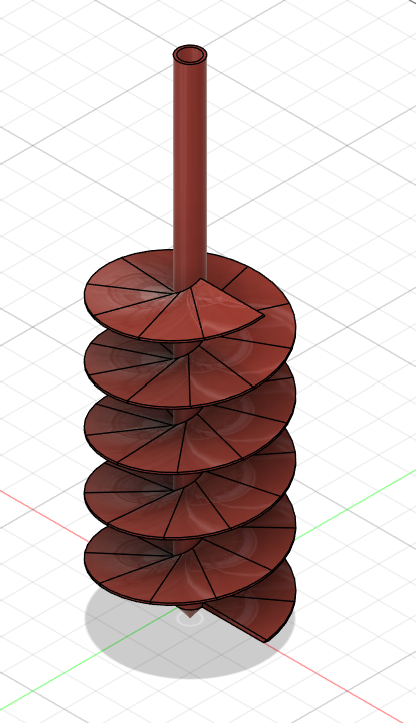

# Day 16 — Auger

> 🎥 YouTube: [Link to this day's video once published]

## Objective
Model a segmented helical auger — a central drive shaft with stacked, radially-divided flighting discs wound around it in a helical progression.

## Skills Practiced
- Central shaft modeling (simple revolve/extrude cylinder)
- Helical/coil-driven placement of repeating flighting discs along the shaft
- Radial patterning to divide each flighting disc into segmented panels
- Stacking repeated geometry with a consistent helical offset per level
- Working with layered, semi-organic mechanical geometry rather than a single solid block

## CAD Features Used
Revolve, Coil/Helix, Circular Pattern, Extrude, Rectangular/Circular Pattern along a path

## Challenges
- Getting each flighting disc to rotate by a consistent offset from the one below it, so the stack reads as a continuous helical progression rather than randomly rotated layers.
- Keeping the segmented panel divisions aligned consistently across every disc in the stack.
- Balancing disc spacing along the shaft so the flighting overlaps enough to look continuous without the geometry colliding.

## How I Solved Them
Built one flighting disc with its radial segment pattern fully defined first, then used a consistent rotational offset per Z-height increment when stacking copies along the shaft — effectively approximating a helix by manually incrementing angle and height together rather than a single continuous coil sweep.

## Engineering Notes
A real-world auger flighting is typically a single continuous helical ribbon; this version approximates that with stacked segmented discs, which is easier to control panel-by-panel but sacrifices the smooth continuous helix of a true screw conveyor.

## Manufacturing Considerations
As modeled, this segmented approach is actually well suited to 3D printing (each disc prints flat-ish without steep overhangs) compared to a true continuous helical flighting, which would need supports or specialized manufacturing (roll-forming, casting) to produce.

## Material Suggestions
Steel or stainless steel for a functional grain/material-handling auger; PETG or nylon if 3D printed for a lighter-duty or demonstration version.

## Improvements
Could model true continuous helical flighting using a coil-driven loft instead of stacked discs, for a more manufacturing-accurate representation of a real auger screw.

## Time Taken
_Approx. time spent modeling today._

## Final Images
| View | Preview |
|---|---|
| Isometric View |  |

## Download Files
- [STEP File](./CAD/Model.step)
- [OBJ File](./CAD/Model.obj)
- [MTL File](./CAD/Model.mtl)
