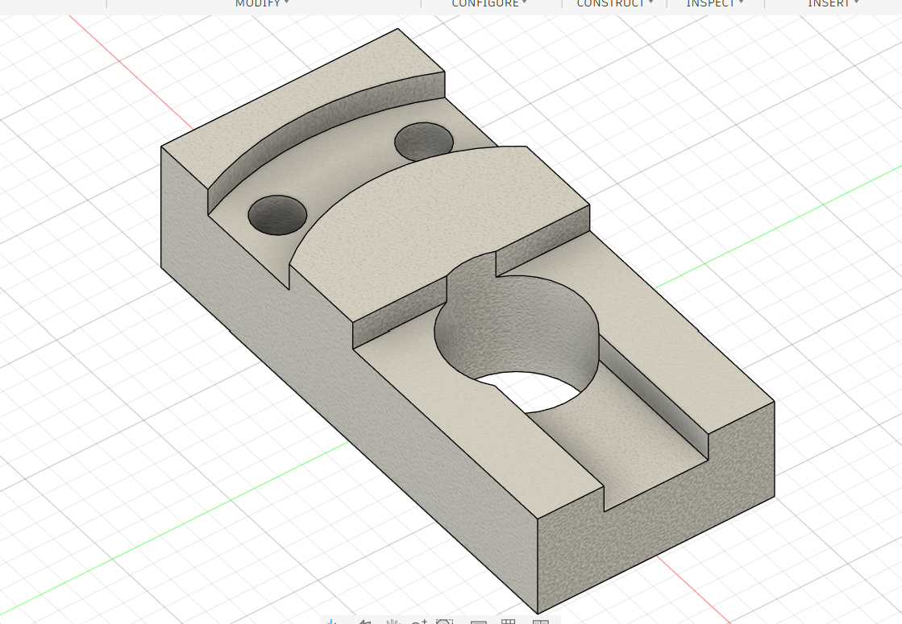

# CAD Designs Practice Set — Part 01: Pivot Clevis Bracket

**Practice source:** CAD Designs (caddesigns.in) — free mechanical practice drawing set.
Modeled independently in Autodesk Fusion 360 by Sumit Sahu.

[YouTube Reference — link pending]

## Objective
Model a clevis-style pivot mounting bracket from a dimensioned four-view engineering drawing (front, right, section A-A, isometric) — featuring a large center bore through a stepped/angled top profile, a slot cut through the base, two small mounting through-holes, and multiple 45° chamfers.

## Skills Practiced
- Reading a full orthographic drawing set including a section view (Section A-A) and translating it into 3D features
- Sketch-driven angled/curved top surface profile
- Extrude Cut for the large center bore and base slot
- Chamfer (45° x distance style, as called out on the drawing)
- Small through-hole placement referencing angled datum lines from the drawing

## CAD Features Used
- Sketch (base profile, angled top profile, bore/slot profiles)
- Extrude (base body)
- Extrude Cut (center bore, base slot, two small through-holes)
- Chamfer (45° edge breaks)
- Fillet (curved top transitions)

## Challenges
The drawing's dimensioning scheme for the top profile used angular callouts (18°, 36°) referenced from a central datum rather than simple linear dimensions, which made directly sketching the curved/angled top surface less straightforward than a standard orthographic-to-sketch translation.

## How I Solved Them
Rebuilt the angular reference lines from the drawing as construction geometry in the sketch first, then used those as anchors for the actual profile curves — this let the sketch mirror the drawing's own dimensioning logic instead of trying to reverse-engineer equivalent linear dimensions.

## Engineering Notes
The large center bore combined with the base slot suggests this bracket is designed to pivot or clamp around a shaft or pin, with the slot allowing either assembly clearance or a degree of clamping flexibility. The two smaller through-holes are positioned for mounting the bracket to a fixed surface, and the section view (Section A-A) in the original drawing confirms the bore's stepped internal profile isn't a simple through-bore but has an internal shoulder.

## Manufacturing Considerations
This part suits CNC milling from solid stock — the angled top face, center bore, and mounting holes are all standard multi-axis or set-up-and-reposition milling operations. The 45° chamfers called out on the drawing would typically be done as a secondary deburring/chamfering pass.

## Material Suggestions
Aluminum or mild steel would suit a real clevis/pivot bracket application. For a 3D-printed practice model, PLA or PETG is sufficient, though the bore tolerance would need adjustment if a real pin/shaft were meant to fit through it.

## Improvements
Double-check the internal bore step (visible in the drawing's Section A-A view) is fully captured in the model — if the current model uses a simple through-bore, adding the internal shoulder would bring it closer to the reference drawing's actual design intent.

## Time Taken
_Pending — let me know and I'll fill this in._

## Final Images

| View | Image |
|------|-------|
| Isometric |  |

## Download Files
- [Model.step](CAD/Model.step)
- [Model.obj](CAD/Model.obj)
- [Model.mtl](CAD/Model.mtl)
