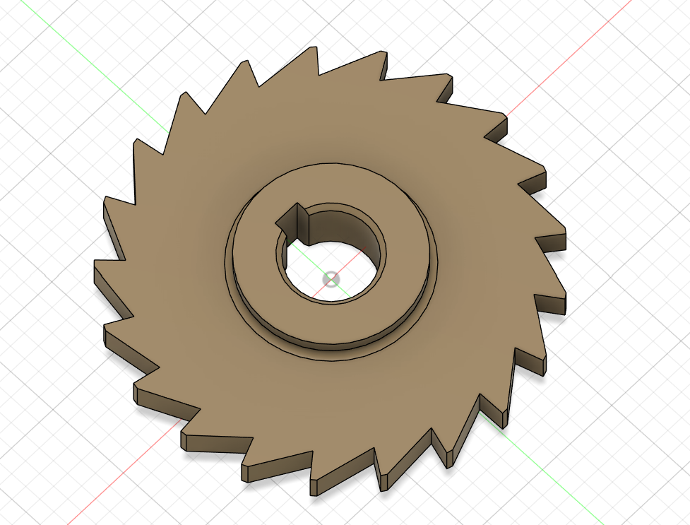
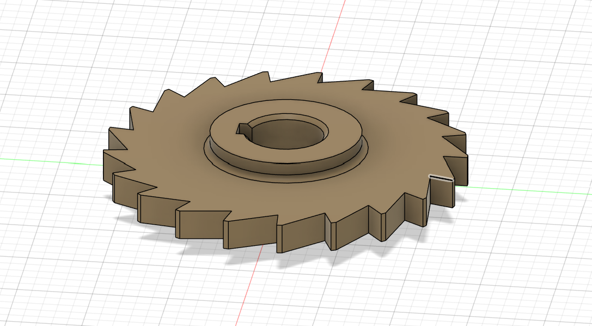

# CAD Designs Practice Set — Part 02: Side Milling Cutter

**Practice source:** CAD Designs (caddesigns.in) — free mechanical practice drawing set.
Modeled independently in Autodesk Fusion 360 by Sumit Sahu.

[YouTube Reference — link pending]

## Objective
Model a side/slab milling cutter: a toothed disc with evenly spaced sawtooth cutting teeth around its full circumference, a raised central hub on both faces, a central keyed bore for mounting on an arbor, and three equidistant mounting/relief holes through the web, all read from a dimensioned four-view drawing (front, section A-A, isometric).

## Skills Practiced
- Circular pattern for evenly repeating a single tooth profile around the full disc circumference
- Sketch-driven keyway profile inside a circular bore
- Revolve/extrude for the raised hub bosses on both faces
- Section-view interpretation (Section A-A) to correctly capture the hub step, chamfer, and bore depth
- Circular pattern for the three equidistant through-holes referenced to a bolt-circle diameter

## CAD Features Used
- Sketch (tooth profile, hub profile, bore + keyway profile, hole placement)
- Extrude (main disc body, hub bosses)
- Extrude Cut (teeth, bore, keyway, mounting/relief holes)
- Circular Pattern (teeth around the full circumference; holes around the bolt circle)
- Chamfer (1.5 x 45° edge breaks noted on the drawing)

## Challenges
Getting the sawtooth profile to repeat cleanly around the full 360° without a visible seam or overlap at the last tooth was the main difficulty — the tooth count and angular pitch had to divide evenly into the full circle, and a small sketch error compounds visibly across that many repetitions.

## How I Solved Them
Fully constrained a single tooth profile to the disc's outer and pitch diameters using angular dimensions matching the drawing's callouts, then used a Circular Pattern set to the exact tooth count so Fusion 360 automatically distributed the teeth at a mathematically even angular pitch — removing any risk of manual angle-entry error accumulating around the circle.

## Engineering Notes
This is a classic side/slab milling cutter geometry — the sawtooth profile around the circumference does the actual cutting when the tool rotates on an arbor, the keyed central bore transmits torque from the arbor to the cutter body, and the raised hub bosses on each face provide a shorter, more precise bearing/locating surface than the full disc width would. The three holes through the web likely reduce weight and rotating inertia while also aiding heat dissipation during cutting.

## Manufacturing Considerations
A real cutter like this would be machined from tool steel and require a separate hardening and tooth-grinding/sharpening process after the base geometry is machined — the tooth cutting edges are the functional surfaces and need much tighter tolerances and surface finish than the rest of the body. As a modeling exercise, the geometry itself is well suited to CNC milling or turning for the disc/hub, with the teeth cut via indexed milling.

## Material Suggestions
High-speed steel (HSS) or carbide would be used for a real cutting tool of this type, given the wear and heat at the cutting edges. For a 3D-printed practice model, PLA or PETG is sufficient — no cutting performance is expected from a printed part.

## Improvements
Double-check the hub-to-disc chamfer/step visible in the drawing's Section A-A view is fully captured — if the current model simplifies this transition, adding the exact stepped profile would bring it closer to the reference drawing's actual design intent.

## Time Taken
_Pending — let me know and I'll fill this in._

## Final Images

| View | Image |
|------|-------|
| Isometric |  |
| Isometric (alt angle) |  |

## Download Files
- [Model.step](CAD/Model.step)
- [Model.obj](CAD/Model.obj)
- [Model.mtl](CAD/Model.mtl)
