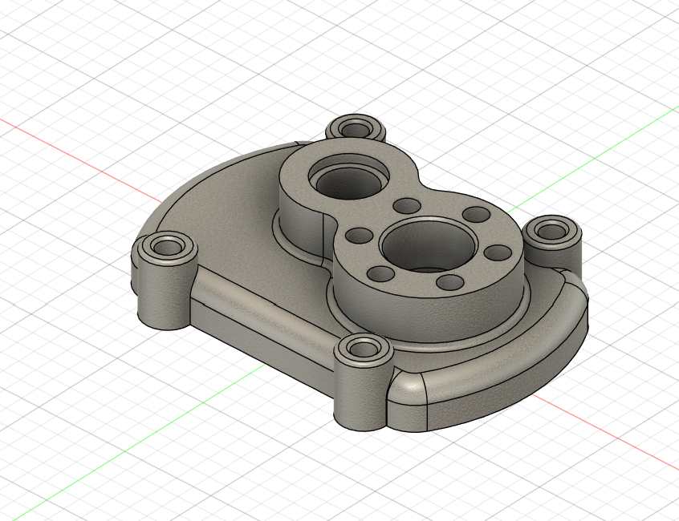
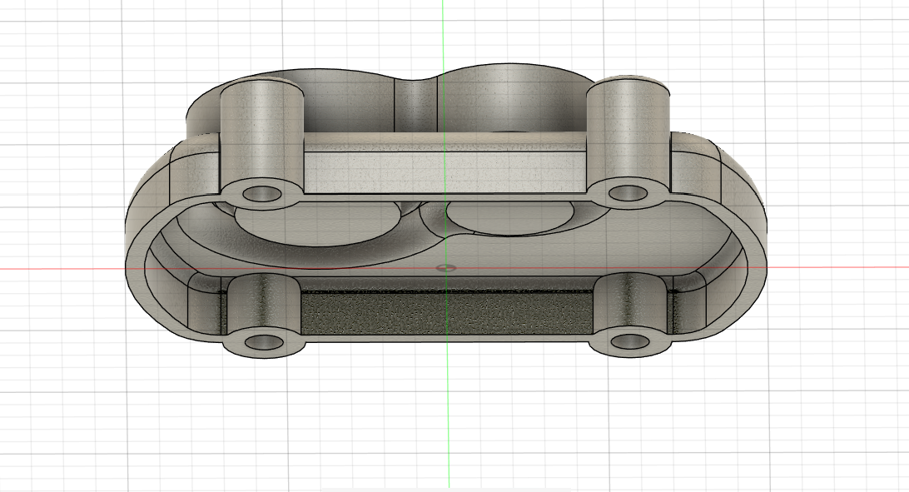
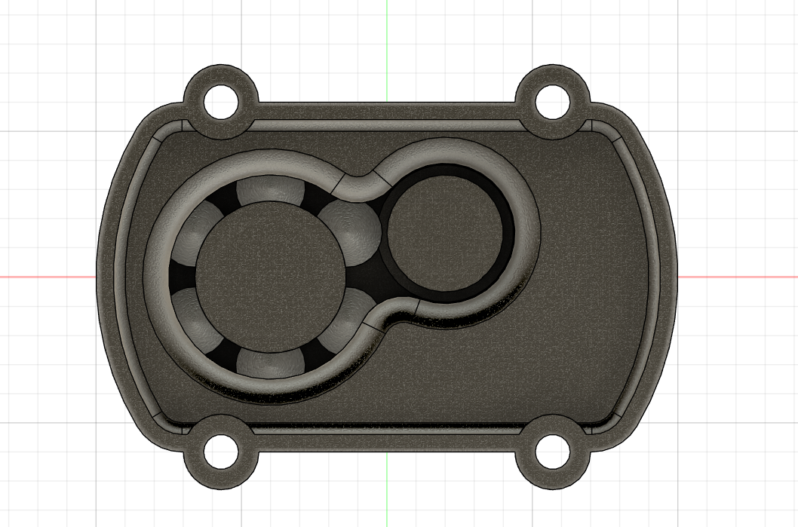
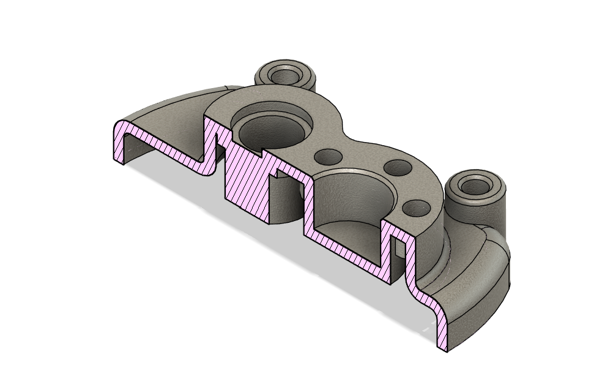

# CAD Designs Practice Set — Part 06: Pump Cover Plate

**Practice source:** CAD Designs (caddesigns.in) — free mechanical practice drawing set.
Modeled independently in Autodesk Fusion 360 by Sumit Sahu.

[YouTube Reference — link pending]

## Objective
Model a pump cover/mounting flange plate: a rounded rectangular body with two overlapping large bores (one housing a visible bearing race detail, the other a plain through-bore), four corner-mounted counterbored bolt bosses, and six equidistant M12 threaded holes arranged around the main bore — all read from a dimensioned four-view drawing (front, section A-A, section B-B, isometric).

## Skills Practiced
- Reading a drawing with two separate section views (Section A-A and Section B-B) and reconciling them into one consistent 3D model
- Overlapping bore geometry — modeling two intersecting circular pockets that blend into a single continuous cavity
- Circular Pattern for the six equidistant M12 threaded holes around the main bore
- Counterbored hole modeling at the four corner mounting bosses
- Managing a part with both a thin flat flange region and thicker bossed/bored regions

## CAD Features Used
- Sketch (flange outline, bore profiles, boss profiles, hole placement)
- Extrude (main flange body, corner mounting bosses)
- Extrude Cut (overlapping main bores, six M12 threaded holes, four corner counterbores)
- Circular Pattern (six equidistant M12 holes)
- Chamfer (1.5 x 45° edge breaks noted on the drawing)
- Fillet (R100 outer profile corners, R18/R10 transition fillets)

## Challenges
Getting the two overlapping bores (Ø60 and Ø35 in the drawing) to blend into a single smooth cavity — matching the "peanut" shaped overlap visible in the front view — without leaving an unwanted seam or step where the two circles intersect was the main modeling difficulty.

## How I Solved Them
Sketched both bore circles in the same sketch and let Fusion 360's Extrude Cut operation handle the boolean union of the two overlapping circular cuts in one operation, rather than trying to model the blended outline as a single complex spline — this guaranteed a mathematically clean intersection matching the drawing's overlap exactly.

## Engineering Notes
This part reads as a pump housing cover or mounting flange — the two overlapping bores likely correspond to a gear pump's inlet/outlet chamber or twin-lobe cavity, the six M12 threaded holes secure the cover to the pump housing, and the four corner counterbored bosses provide additional mounting points, likely to a larger machine base or bracket, with the counterbore recessing the fastener heads flush.

## Manufacturing Considerations
This part is well suited to CNC milling from block stock, or casting for higher-volume production given the flange's relatively complex bore geometry. The overlapping bore cavity would need a boring or milling operation capable of cutting the blended profile in one continuous toolpath, and the 1.5×45° chamfers would typically be a secondary deburring pass.

## Material Suggestions
Aluminum or cast iron would suit a real pump cover application, both being common choices for pump housings due to good machinability and adequate strength at the mounting bosses. For a 3D-printed practice model, PLA or PETG is sufficient.

## Improvements
Double-check the internal step visible in Section B-B (the 10/15/21mm stepped bore profile) is fully captured — if the current model simplifies this internal profile, adding the exact stepped depth would bring it closer to the reference drawing's actual design intent.

## Time Taken
_Pending — let me know and I'll fill this in._

## Final Images

| View | Image |
|------|-------|
| Isometric |  |
| Front |  |
| Back |  |
| Section Analysis |  |

## Download Files
- [Model.step](CAD/Model.step)
- [Model.obj](CAD/Model.obj)
- [Model.mtl](CAD/Model.mtl)
