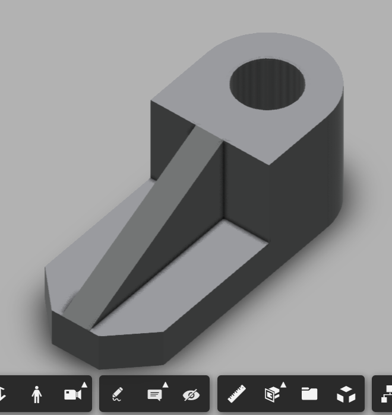

# 01 — Fixture Block

## Objective
Model a fixture block from the KKMSoft/Autodesk machine design practice set — a base block with an angled taper, a rounded boss with a through-bore, and a slotted keyway cut through the body. A good early exercise in reading a two-view orthographic drawing and translating it into a sequence of extrude features.

## Skills Practiced
- Reading and interpreting a dimensioned two-view (top + front) orthographic drawing
- Sketch (base profile, tapered face, boss profile with bore)
- Extrude (base block, angled taper, cylindrical boss)
- Extrude Cut (through-bore, slotted keyway)

## CAD Features Used
- Sketch
- Extrude (Join)
- Extrude Cut

## Challenges
Determining the correct feature order to get the angled taper (a straight 30°-style sloped face) and the rounded boss with its through-hole to combine cleanly without leftover material or an incorrect intersection where the taper meets the boss.

## How I Solved Them
Built the base rectangular block and angled taper first as the foundational body, then added the rounded boss as a separate Join extrude on top, and finally cut the through-bore and keyway slot last — keeping cuts as the final operations in the timeline avoided any conflicts with the earlier joining features.

## Engineering Notes
This part is a good reminder that even a "simple" two-feature-looking part often benefits from being broken into more, smaller extrude operations rather than one complex sketch — each individual sketch stayed simple, and the complexity came from combining several simple features in the right order.

## Manufacturing Considerations
As the drawing's file name and description suggest ("Hardware, Fixture Block"), this is designed as a machined part — the through-bore and slot would realistically be milled or drilled into a solid blank, which is consistent with modeling it as extrude cuts from a solid block rather than as a molded or sheet part.

## Material Suggestions
Mild steel or aluminum, typical for a machined fixture/tooling component.

## Improvements
Add the fillets/rounds implied by the reference render (the boss-to-taper transition looks softened in the reference image) for a closer match to the original design intent.

## Time Taken
_Add your actual time here_

## Reference Used
This part's dimensions and geometry come from a drawing sheet in a 25-part machine design practice set created by **Curtis Waguespack**, distributed by **KKMSoft** (see `Machine-Design-Practice-Pack/README.md` for full attribution). The reference sheet is stored in `Reference/Reference-Drawing-Sheet.png` for my own record — the modeling work is mine, the design/dimensions are the original author's.

## Final Images

## Download Files
_CAD files (STEP/F3D/STL) not yet uploaded for this part — add them to `CAD/` when available._
