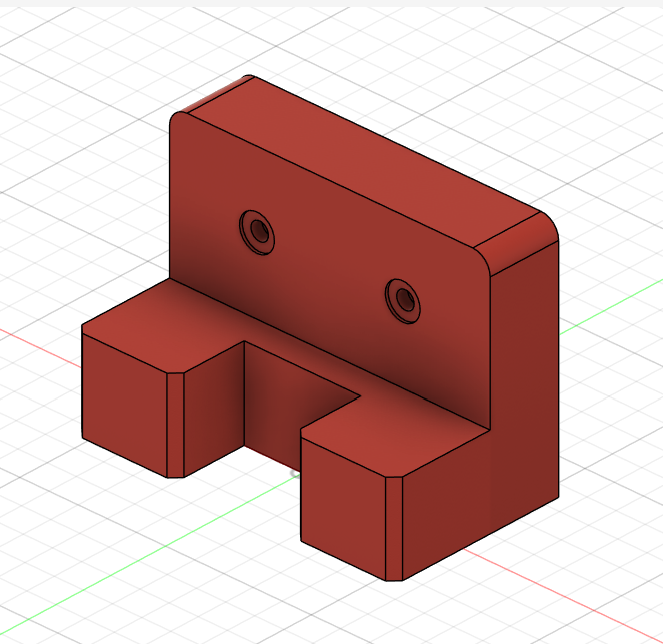

# Machine Design Practice Pack — Part 02: Mount Bracket

**Practice source:** Curtis Waguespack / KKMSoft — Machine Design Practice Pack.
Modeled independently in Autodesk Fusion 360 by Sumit Sahu.

[YouTube Reference — link pending]

## Objective
Model an L-shaped mounting bracket featuring a tall vertical back plate with two counterbored mounting holes, a notched/stepped base with two supporting feet, and rounded corners on the top of the back plate.

## Skills Practiced
- Combining a tall back plate with a stepped, notched base in one body
- Counterbore hole creation (two-diameter stepped hole) for fastener heads
- Fillet on the top corners of the vertical plate
- Extrude Cut for the U-shaped notch between the two base feet
- Managing a part with two distinct "wings" (front feet) meeting a single back plate

## CAD Features Used
- Sketch (back plate profile, base/feet profile, hole placement)
- Extrude (back plate, base with feet)
- Extrude Cut (counterbore holes, base notch)
- Fillet (top corners of the back plate)

## Challenges
Getting the base's two feet and the central notch between them to align cleanly with the back plate's width — since the feet, notch, and back plate all share edges but come from different sketch operations, keeping everything symmetric about the same centerline took care.

## How I Solved Them
Sketched the base profile (feet + notch) on the same reference plane and centerline as the back plate, using symmetric constraints tied to a shared center construction line rather than dimensioning each foot independently. This kept the whole base symmetric automatically, even when adjusting notch width or foot size later.

## Engineering Notes
This is a classic mounting bracket geometry — the two counterbored holes in the back plate allow it to be bolted flush to a vertical surface (the counterbore recesses the fastener head below the plate's front face), while the notched two-foot base likely locates onto or straddles another component, or simply provides a wider, more stable footprint than a single solid foot would.

## Manufacturing Considerations
This part is well suited to CNC milling from block stock, or could be cast for higher-volume production given its relatively simple stepped geometry. The counterbore holes would be machined as a two-step drilling operation (pilot hole + counterbore), and the fillet on the back plate's top corners would need to be included in any casting mold or as a deburring pass if machined.

## Material Suggestions
Aluminum or mild steel would suit a real mounting bracket application well. For a 3D-printed practice model, PLA or PETG is sufficient.

## Improvements
Adding a small fillet where the feet meet the back plate would reduce stress concentration at that internal corner, which is likely to see combined shear and bending load in a real mounted application.

## Time Taken
_Pending — let me know and I'll fill this in._

## Final Images

| View | Image |
|------|-------|
| Isometric |  |

## Download Files
- [Model.step](CAD/Model.step)
- [Model.obj](CAD/Model.obj)
- [Model.mtl](CAD/Model.mtl)
