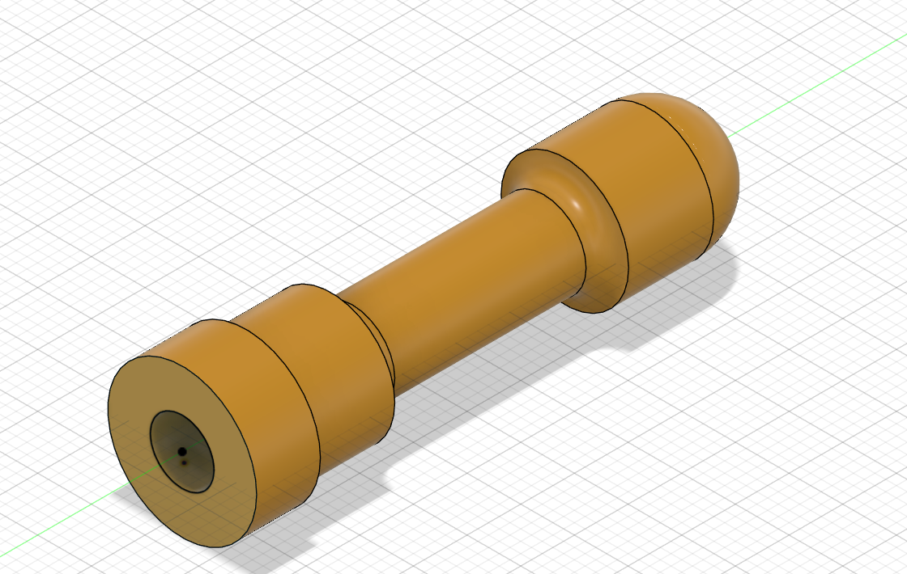

# Machine Design Practice Pack — Part 03: Valve Lifter

**Practice source:** Curtis Waguespack / KKMSoft — Machine Design Practice Pack.
Modeled independently in Autodesk Fusion 360 by Sumit Sahu.

[YouTube Reference — link pending]

## Objective
Model a shaft-style valve lifter part: a stepped cylindrical rod with a rounded (domed) end on one side, a small counter-bored hole on the opposite flat end, and multiple diameter steps and fillets transitioning along its length.

## Skills Practiced
- Revolve for the rounded dome end
- Multi-diameter stepped shaft modeling (sketch + extrude/revolve along a single axis)
- Fillet transitions between different shaft diameters
- Small counter-bore/spot-face hole on a flat end face
- Maintaining concentricity across several revolved/extruded features sharing one axis

## CAD Features Used
- Sketch (shaft profile, half-section for revolve)
- Revolve (main shaft body + domed end)
- Extrude Cut (small hole/counter-bore on the flat end)
- Fillet (diameter-step transitions)

## Challenges
Keeping every diameter step perfectly concentric along the shaft's single axis was the main difficulty — a revolved part is very sensitive to sketch symmetry, and any small centerline offset shows up immediately as a visible wobble in the final body.

## How I Solved Them
Built the entire profile as a single half-section sketch constrained directly to the shared centerline, then revolved it 360° in one operation instead of building separate extruded cylinders and trying to align them afterward. This guaranteed perfect concentricity by construction rather than by adjustment.

## Engineering Notes
This shape is typical of a mechanical valve lifter or tappet — the domed end contacts a cam lobe (the rounded profile reduces sliding friction and wear as the cam rotates against it), while the stepped shaft diameters likely locate the part inside a guide bore and provide a shoulder for a spring or retaining feature. The small hole on the flat end could serve as a lubrication passage or a locating feature for assembly.

## Manufacturing Considerations
A part like this would typically be manufactured on a lathe — the stepped diameters, rounded dome, and central hole are all natural turning operations, with the small end-face hole drilled afterward. Surface finish at the domed contact face would matter most in a real application, since that's the wear surface against the cam.

## Material Suggestions
Hardened tool steel or case-hardened alloy steel would suit a real valve lifter, given the repeated sliding/wear contact at the domed end. For a 3D-printed practice model, PLA or PETG is sufficient.

## Improvements
Adding a small chamfer at the flat end's outer edge would ease handling and assembly, and increasing the fillet radius at the shoulder transitions would reduce stress concentration if this part saw cyclic loading in a real cam-follower application.

## Time Taken
_Pending — let me know and I'll fill this in._

## Final Images

| View | Image |
|------|-------|
| Isometric |  |

## Download Files
- [Model.step](CAD/Model.step)
- [Model.obj](CAD/Model.obj)
- [Model.mtl](CAD/Model.mtl)
