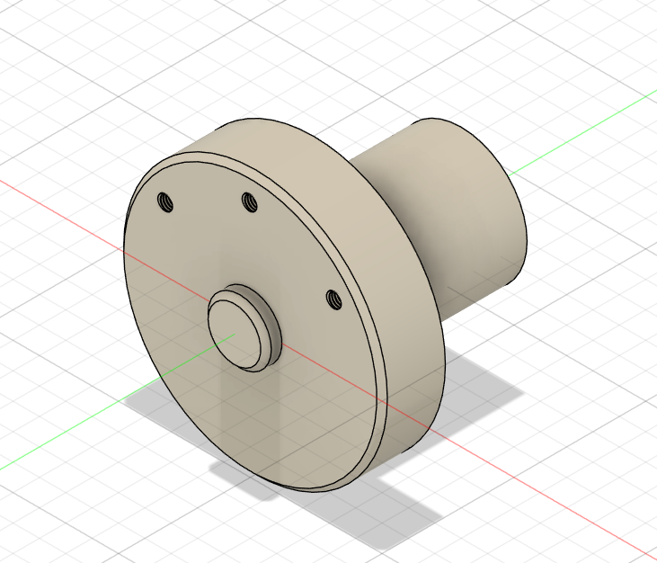

# Machine Design Practice Pack — Part 04: Housing Fixture

**Practice source:** Curtis Waguespack / KKMSoft — Machine Design Practice Pack.
Modeled independently in Autodesk Fusion 360 by Sumit Sahu.

[YouTube Reference — link pending]

## Objective
Model a disc-style housing fixture featuring a large flat circular flange face with three equally spaced small mounting/tapped holes, a central raised boss, and a stepped cylindrical spigot extending out the back.

## Skills Practiced
- Revolve/Extrude for a disc-and-boss body with a stepped back spigot
- Circular pattern for evenly spacing the three mounting holes around the flange
- Managing concentricity between the flange, central boss, and rear spigot along one shared axis
- Small hole placement referencing a bolt-circle diameter

## CAD Features Used
- Sketch (flange profile, boss profile, spigot profile, hole placement)
- Revolve or Extrude (main disc body, boss, rear spigot)
- Extrude Cut (three mounting holes)
- Circular Pattern (repeating the mounting hole around the bolt circle)

## Challenges
Placing the three mounting holes at an even, correct angular spacing around the flange's bolt circle was the main difficulty — getting the circular pattern's center point and reference axis exactly aligned with the disc's true center was needed for the holes to land symmetrically.

## How I Solved Them
Modeled just one mounting hole first, fully constrained to the flange's center axis and bolt-circle diameter, then used a Circular Pattern feature referencing that same center axis to generate the remaining two holes automatically at even 120° spacing, instead of manually sketching and dimensioning each hole separately.

## Engineering Notes
This part reads as a small housing/end-cap fixture — the flat flange face with its three-hole bolt pattern suggests it mounts to a matching housing or enclosure, the central raised boss likely provides a locating pilot or bearing seat, and the rear cylindrical spigot could serve as a shaft guide, a press-fit interface, or a mounting stub for another component.

## Manufacturing Considerations
This part is well suited to being turned on a lathe for the disc, boss, and spigot (all naturally axisymmetric features), with the three mounting holes drilled/tapped afterward as a secondary milling operation. Concentricity between the front boss and the rear spigot would be the key manufacturing tolerance to control.

## Material Suggestions
Aluminum or mild steel would suit a real housing fixture like this well, offering enough rigidity at the mounting flange while keeping the part reasonably light. For a 3D-printed practice model, PLA or PETG is sufficient.

## Improvements
Adding a small chamfer at the outer edge of the flange and at the spigot's leading edge would ease handling and assembly into a mating housing.

## Time Taken
_Pending — let me know and I'll fill this in._

## Final Images

| View | Image |
|------|-------|
| Isometric |  |

## Download Files
- [Model.step](CAD/Model.step)
- [Model.obj](CAD/Model.obj)
- [Model.mtl](CAD/Model.mtl)
