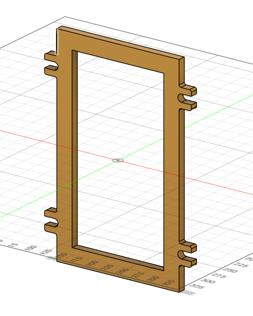
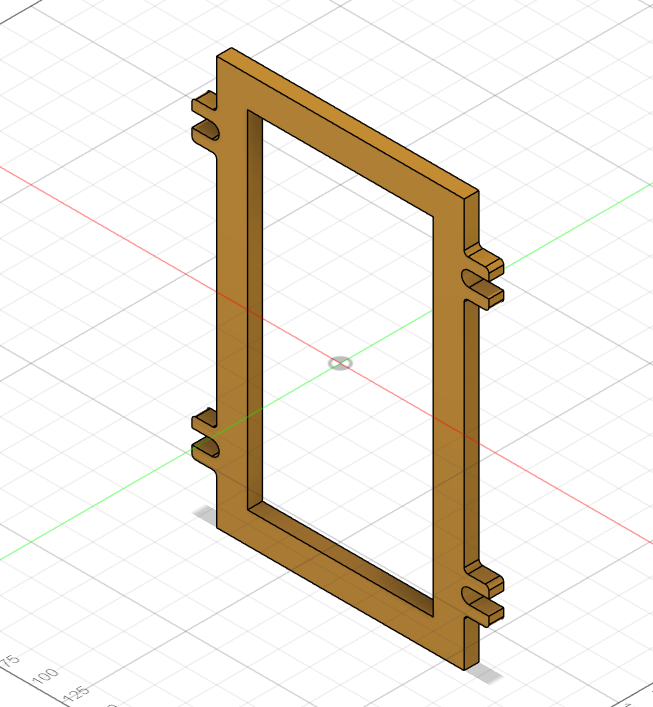

# Machine Design Practice Pack — Part 05: Hopper Flange

**Practice source:** Curtis Waguespack / KKMSoft — Machine Design Practice Pack.
Modeled independently in Autodesk Fusion 360 by Sumit Sahu.

[YouTube Reference — link pending]

## Objective
Model a rectangular open frame (flange-style border) with small interlocking tab/notch features cut into all four corner regions on both sides — a shape typical of a hopper or chute flange designed to bolt or key into a mating component.

## Skills Practiced
- Thin rectangular frame modeling via Shell or offset-profile extrude
- Sketch-driven small tab/notch cutouts repeated symmetrically on both edges
- Maintaining wall thickness consistency around a closed rectangular loop
- Precise placement of small repeating features near a part's edges without breaking symmetry

## CAD Features Used
- Sketch (outer rectangle, inner rectangle for the frame opening, tab/notch profiles)
- Extrude (frame body)
- Shell / Extrude Cut (hollow center opening)
- Extrude Cut (edge tabs/notches)
- Mirror (repeating the tab/notch pattern symmetrically)

## Challenges
Keeping the small tab/notch cutouts on each side perfectly mirrored and evenly spaced was the main difficulty — with four small features per side, any asymmetry in spacing or depth becomes immediately visible on a simple rectangular frame like this.

## How I Solved Them
Sketched one tab/notch feature fully constrained to the frame's centerline, then used a Mirror operation across both the vertical and horizontal centerlines to generate the remaining three symmetric copies automatically, rather than manually positioning each one.

## Engineering Notes
This flange shape is consistent with a hopper or chute mounting flange — the open rectangular center allows material flow through the frame, while the small edge tabs/notches likely serve as a keying or alignment feature so the flange seats correctly against a matching flange or housing before fasteners are installed, preventing rotational misalignment during assembly.

## Manufacturing Considerations
This part is well suited to being cut from flat sheet stock (laser or waterjet) given its uniform thickness and open frame profile, or CNC milled if a thicker/more rigid flange is required. The small tab features would need to be included directly in the cutting profile rather than added as a secondary operation.

## Material Suggestions
Mild steel or aluminum sheet would suit a real hopper flange application, offering enough rigidity while keeping the part lightweight. For a 3D-printed practice model, PLA or PETG is sufficient.

## Improvements
Adding a small chamfer or fillet along the inner opening's edges would reduce material buildup or snagging risk if this flange were used with flowing granular material in a real hopper application.

## Time Taken
_Pending — let me know and I'll fill this in._

## Final Images

| View | Image |
|------|-------|
| Isometric |  |
| Isometric (alt angle) |  |

## Download Files
- [Model.step](CAD/Model.step)
- [Model.obj](CAD/Model.obj)
- [Model.mtl](CAD/Model.mtl)
