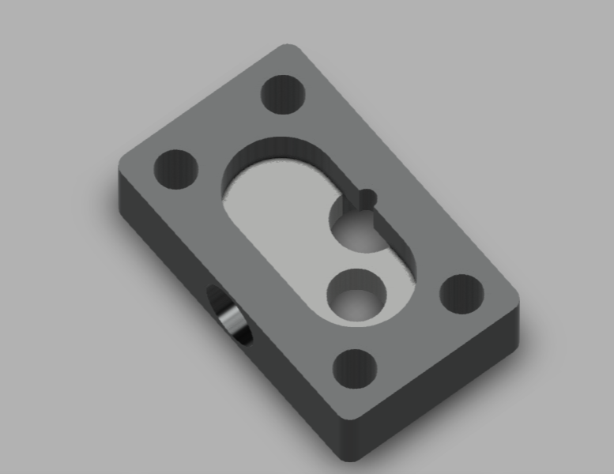

# 06 — Gear Pump Body

## Objective
Model a gear pump body from the KKMSoft/Autodesk practice set — a mounting plate with a stadium-shaped (slot-ended) pump cavity, two offset internal bores for gear shafts, and a bolt-hole pattern, requiring two section views to fully capture the internal geometry.

## Skills Practiced
- Reading and combining Section A-A and Section B-B to understand internal cavity depth and stepped bore geometry
- Sketch (stadium-shaped cavity profile, mounting hole pattern)
- Extrude Cut (stepped-depth internal cavity, mounting holes, offset gear bores)
- Working from a part with a distinct front (thick, bored) and back (thin, flat mounting face)

## CAD Features Used
- Sketch
- Extrude (base plate)
- Extrude Cut (cavity, bores, mounting holes)
- Fillet (rounded cavity ends, corner rounds per the R1 callouts)

## Challenges
Getting the internal gear cavity's stepped depth correct — the cavity isn't a single uniform pocket; Section A-A shows a shallower full-cavity depth with a deeper stepped bore for one gear shaft, which isn't obvious from the top view alone.

## How I Solved Them
Worked through Section B-B first to establish the two different depths as separate extrude cuts (one shallow cut across the full stadium shape, one deeper cut for the shaft bore), rather than trying to capture the whole cavity as a single cut — matching the section view's implied two-step depth change.

## Engineering Notes
This part reinforced why multiple section views exist on a real drawing — Section A-A and Section B-B each reveal different internal depth information that the top view alone can't communicate, and correctly modeling the part required cross-referencing both rather than relying on just one.

## Manufacturing Considerations
Labeled "Machined, Pump Base" on the original drawing — the stepped internal cavity and precise bore-to-bore spacing (critical for gear mesh alignment in a real gear pump) point clearly to CNC machining from a solid blank rather than casting, where that level of dimensional precision on mating gear bores would be harder to hold.

## Material Suggestions
Aluminum or bronze are common real-world gear pump body materials, chosen for machinability and, in bronze's case, natural wear resistance against rotating gear shafts.

## Improvements
Model the two gear bores to different final depths as shown (one appears to be a through-bore, the other a blind/stepped bore) with more precision, and add the implied fastener threads at the four corner mounting holes rather than leaving them as plain through-holes.

## Time Taken
_Add your actual time here_

## Reference Used
This part's dimensions and geometry come from a drawing sheet in a 25-part machine design practice set created by **Curtis Waguespack**, distributed by **KKMSoft** (see `Machine-Design-Practice-Pack/README.md` for full attribution). The reference sheet is stored in `Reference/Reference-Drawing-Sheet.png` for my own record — the modeling work is mine, the design/dimensions are the original author's.

## Final Images

## Download Files
_CAD files (STEP/F3D/STL) not yet uploaded for this part — add them to `CAD/` when available._
