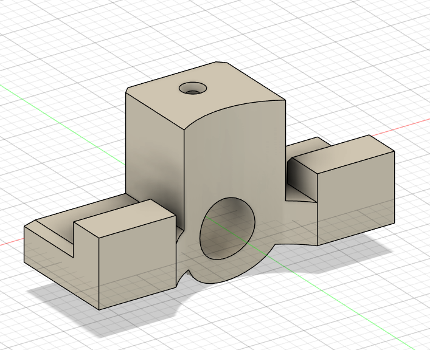
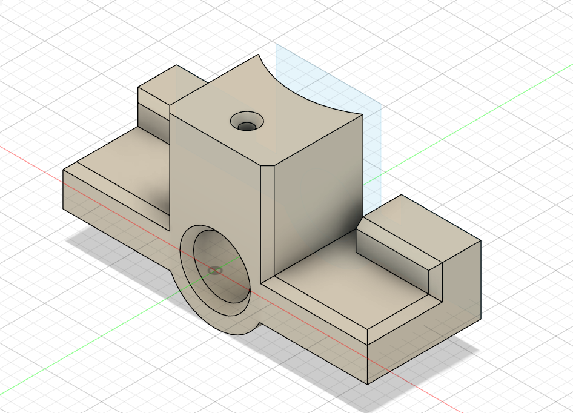
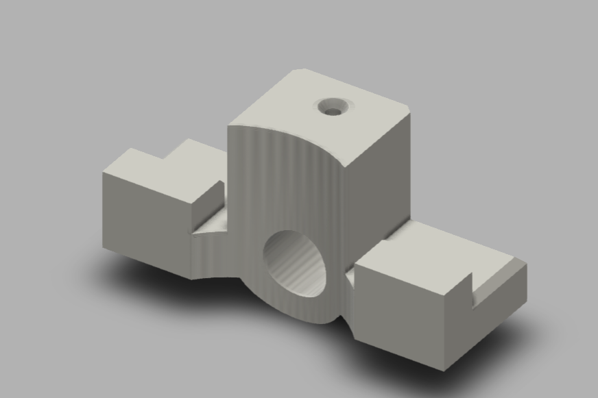

# Machine Design Practice Pack — Part 07: Alignment Bracket

**Practice source:** Curtis Waguespack / KKMSoft — Machine Design Practice Pack.
Modeled independently in Autodesk Fusion 360 by Sumit Sahu.

[YouTube Reference — link pending]

## Objective
Model an alignment bracket featuring a central cylindrical boss with a through-bore and a small top-face mounting hole, flanked on both sides by stepped rectangular tabs — one with a slotted notch, the other plain — sitting on a common base.

## Skills Practiced
- Combining a rounded/filleted central boss with flat rectangular side tabs on one base
- Extrude Cut for the large through-bore and the small top-face hole
- Slot/notch cutting on one of the side tabs
- Maintaining symmetry between two differently-detailed side tabs sharing a common base plane
- Working with a part that mixes curved (boss) and flat (tabs) geometry cleanly

## CAD Features Used
- Sketch (base profile, boss profile, tab profiles, hole placement)
- Extrude (base body, central boss, side tabs)
- Extrude Cut (through-bore, top hole, side notch/slot)
- Fillet (boss-to-base transition)

## Challenges
Keeping the central boss's through-bore concentric with the base while the two side tabs — each a different height and one with a notch — stayed correctly aligned to the same base plane was the main difficulty, since the part combines a revolved-style feature with flat extruded tabs in one body.

## How I Solved Them
Built the base and central boss first as the primary aligned body, using the boss's own axis as the main reference, then added each side tab as a separate extrude referencing that same base sketch plane — keeping every feature tied back to one shared reference avoided misalignment between the boss and the tabs.

## Engineering Notes
This bracket's design — a central bore flanked by asymmetric tabs (one notched, one plain) — is typical of an alignment or locating fixture, where the through-bore likely accepts a pin or shaft, and the differently detailed side tabs allow the part to key into a specific orientation against a mating component, preventing incorrect assembly.

## Manufacturing Considerations
This part is well suited to CNC milling from block stock — the bore, top hole, and side notch are all standard milling operations, and the boss's curved top could be machined with a ball-nose or round-tipped tool in the same setup as the rest of the part.

## Material Suggestions
Aluminum or mild steel would suit a real alignment bracket well. For a 3D-printed practice model, PLA or PETG is sufficient.

## Improvements
Adding a small chamfer at the through-bore's entrance would ease assembly of a pin or shaft, and a fillet where the side tabs meet the base would reduce stress concentration at those internal corners.

## Time Taken
_Pending — let me know and I'll fill this in._

## Final Images

| View | Image |
|------|-------|
| Isometric |  |
| Isometric (alt angle) |  |
| Render |  |

## Download Files
- [Model.step](CAD/Model.step)
- [Model.obj](CAD/Model.obj)
- [Model.mtl](CAD/Model.mtl)
