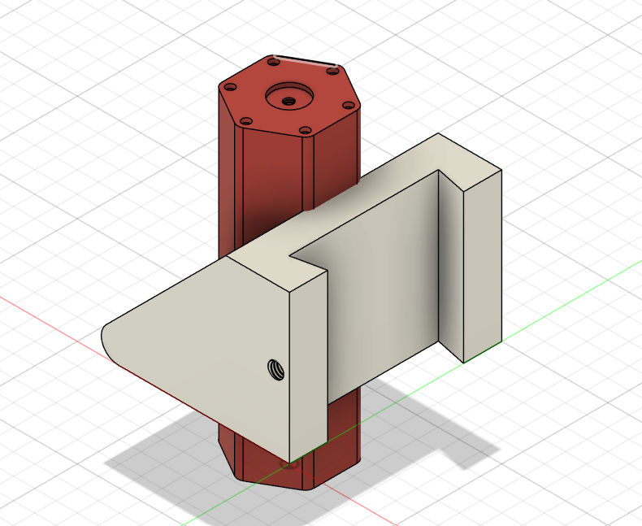
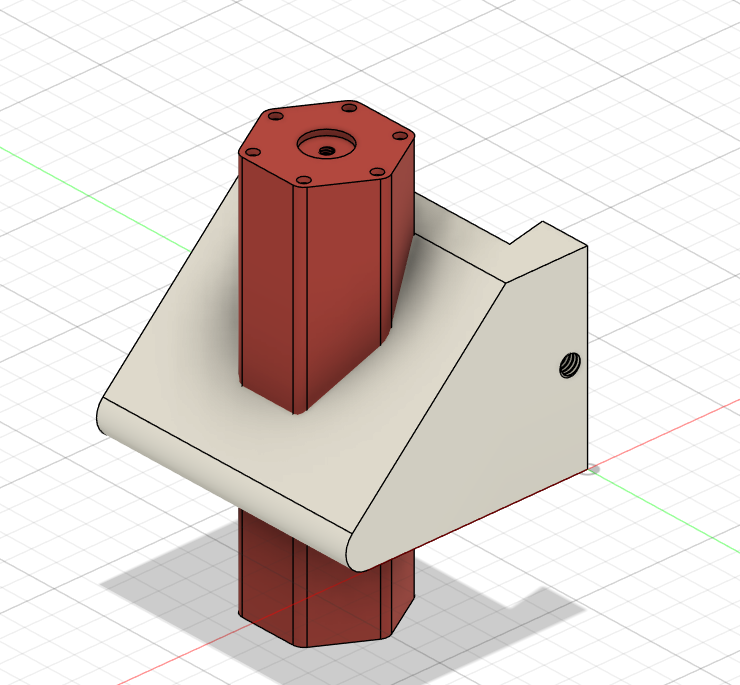
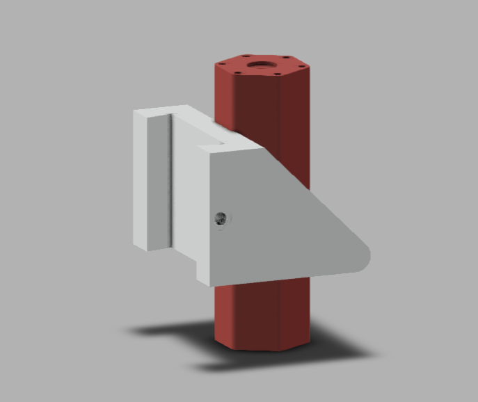

# Guide Stop — Precision Bracket & Guide Stop

**Original design by Sumit Sahu.** Modeled in Autodesk Fusion 360.

## Objective
Design and model a guide stop assembly: a hex-flanged cylindrical post (with a hex bolt-hole pattern and central through-bore on top) combined with an angled wedge-profile clamp bracket that mounts around the post, secured by a single side fastener.

## Skills Practiced
- Hex flange modeling with a circular bolt-hole pattern
- Angled wedge/guide-surface profile on the clamp bracket
- Through-bore and counterbore on the hex flange face
- Side-tapped mounting hole on the bracket
- Assembling two distinct bodies (post + bracket) into one coherent guide-stop unit

## CAD Features Used
- Sketch (hex flange profile, post body, bracket wedge profile)
- Extrude (hex post, bracket body)
- Extrude Cut (through-bore, counterbore, bolt holes, side tapped hole)
- Chamfer (angled guide surface edge)
- Circular Pattern (hex flange bolt holes)

## Challenges
Getting the angled bracket's wedge profile to seat correctly around the hex post without interference, while keeping the bracket's mounting hole properly positioned relative to the post's flange, required careful reference-plane alignment between the two separate bodies.

## How I Solved Them
Modeled the hex post first as the primary reference body, then built the bracket directly against the post's actual geometry (rather than in isolation), using the post's outer faces as sketch references for the bracket's mating profile — this ensured a clean fit without needing manual trial-and-error adjustment.

## Engineering Notes
This assembly functions as a positional guide/stop — the hex-flanged post likely bolts to a fixed structure via its 6-hole bolt pattern, while the angled bracket clamps around it and provides a defined mechanical stop or guide surface for another moving component, with the side fastener locking the bracket's position along the post.

## Manufacturing Considerations
The hex post and its bolt pattern are well suited to CNC milling or turning-and-milling from bar stock, while the bracket's angled wedge profile would be a straightforward multi-axis milling operation. The through-bore and counterbore on the post's top face would typically be drilled and counterbored in one setup.

## Material Suggestions
Aluminum or mild steel would suit this guide stop assembly well, offering enough rigidity at the clamping interface. For a 3D-printed practice model, PLA or PETG is sufficient.

## Improvements
Adding a fillet at the bracket's inner corner (where the wedge meets the vertical clamp face) would reduce stress concentration at that load-bearing transition.

## Time Taken
_Pending — let me know and I'll fill this in._

## Final Images

| View | Image |
|------|-------|
| Isometric |  |
| Isometric (alt angle) |  |
| Render |  |

## Download Files
- [Model.step](CAD/Model.step)
- [Model.obj](CAD/Model.obj)
- [Model.mtl](CAD/Model.mtl)
