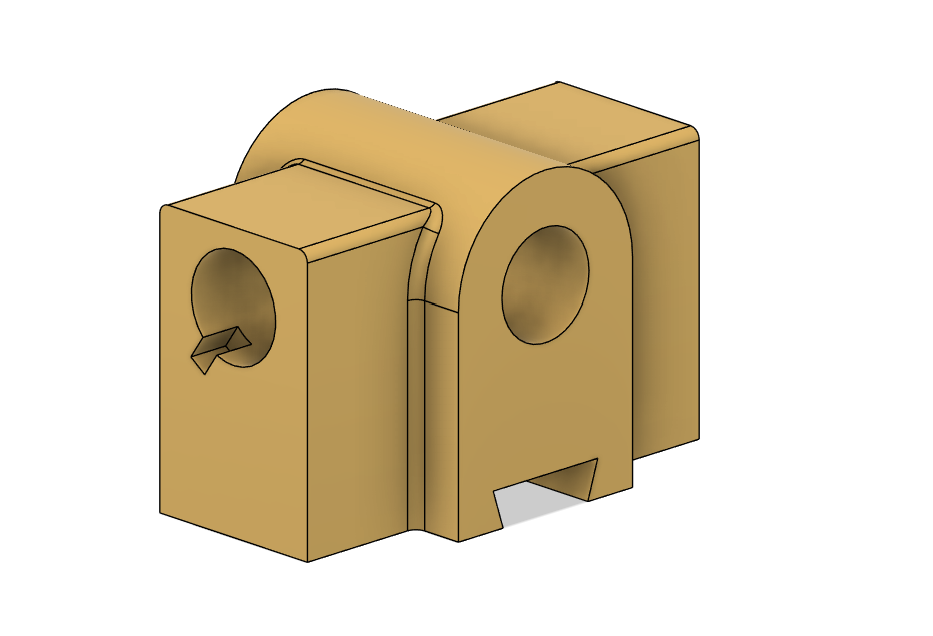
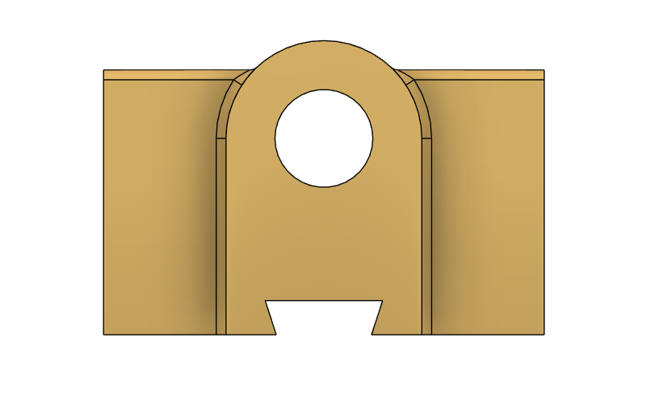

# Machine Design Practice Pack — Part 09: Anchor Slide

**Original design by Sumit Sahu.** Modeled in Autodesk Fusion 360.

[YouTube Reference — link pending]

## Objective
Model an anchor slide: a cross-shaped base block with a rounded top boss featuring a Ø20 through-hole with an 8mm-deep keyway, an angled 72° slot cut into the base, and symmetric side tabs with R2 edge fillets throughout.

## Brief (summarized in my own words)
- Overall footprint: 65 × 55mm (top view), 60mm height
- Rounded top boss: R20 profile, Ø20 through-hole with an 8mm-deep, 35°-angled keyway
- Cross-shaped base with symmetric side tabs
- Angled 72° slot cut into the base front face, 24mm wide
- Material: Mild Steel or Aluminum, tolerance ±0.1mm linear / ±0.5° angular
- R2 edge fillets throughout, deburred edges

## Skills Practiced
- Rounded boss profile combined with a cross-shaped base in one body
- Through-hole with an angled keyway feature at a specified depth
- Angled slot cutting (72° included angle) into a base block
- Symmetric side-tab design referencing a shared centerline
- Reading a drawing with a dedicated keyway detail callout view

## CAD Features Used
- Sketch (base cross-profile, boss profile, hole + keyway profile, angled slot profile)
- Extrude (base body, rounded top boss)
- Extrude Cut (through-hole, keyway, angled slot)
- Fillet (R2 edge breaks throughout, R20 boss profile)

## Challenges
Getting the keyway's depth (8mm) and 35° angle to cut cleanly into the through-hole without leaving an inconsistent wall thickness on one side was the main difficulty, since the keyway's reference angle didn't align with the part's primary sketch planes.

## How I Solved Them
Modeled the keyway as a separate angled sketch plane referencing the hole's own centerline, rather than trying to project it from the main front-view sketch — this let the keyway's angle and depth be defined independently and verified directly against the drawing's dedicated keyway detail view.

## Engineering Notes
This part's Ø20 bore with a keyway suggests it's designed to lock onto a keyed shaft and prevent rotation, while the cross-shaped base with symmetric side tabs likely provides multiple mounting points to a fixed structure. The angled 72° slot in the base may serve as a clearance cut or an adjustment/locking feature.

## Manufacturing Considerations
This part is well suited to CNC milling from block stock — the rounded boss, through-hole, keyway, and angled slot are all standard milling operations, with the keyway likely requiring a dedicated broaching or end-mill slotting pass for a clean keyed fit.

## Material Suggestions
Mild steel or aluminum, as specified on the drawing, would suit a real anchor slide application well, given the moderate load-bearing role implied by the keyed bore.

## Improvements
Double-check the keyway's 8mm depth is captured precisely, since a shallow or oversized keyway would affect the fit of a mating key in a real assembly.

## Time Taken
_Pending — let me know and I'll fill this in._

## Final Images

| View | Image |
|------|-------|
| Isometric |  |
| Front |  |

## Download Files
- [Model.step](CAD/Model.step)
- [Model.obj](CAD/Model.obj)
- [Model.mtl](CAD/Model.mtl)
