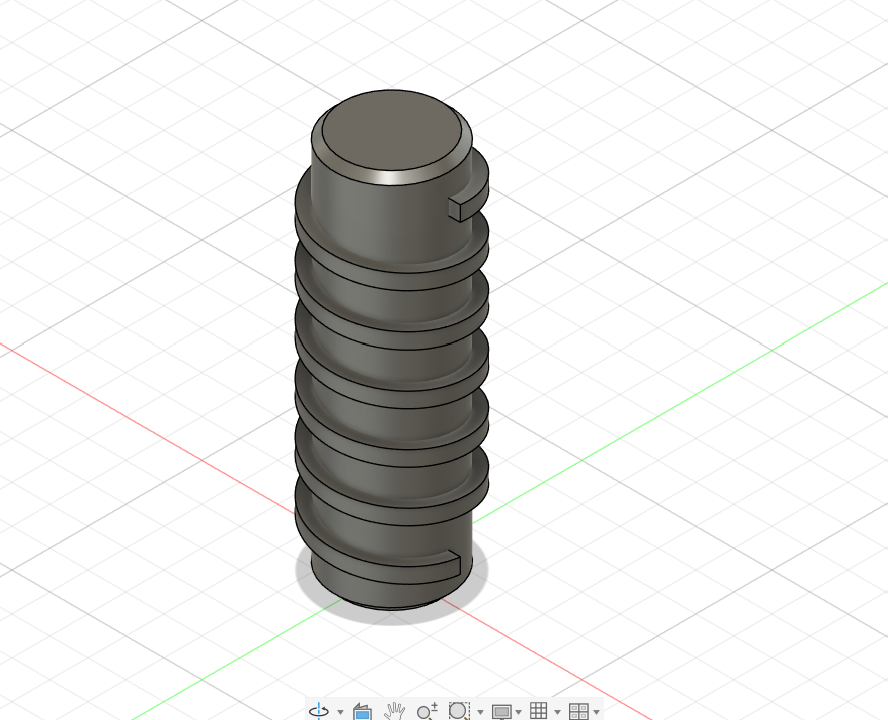

# Machine Design Practice Pack — Part 11: Drive Insert

**Practice source:** Curtis Waguespack / KKMSoft — Machine Design Practice Pack.
Modeled independently in Autodesk Fusion 360 by Sumit Sahu.

[YouTube Reference — link pending]

## Objective
Model a drive insert: a cylindrical shaft featuring a repeating stack of circular grooves along its length, with a small keyway-style tab notch at the top and bottom faces.

## Skills Practiced
- Repeating groove profile via Revolve or Rectangular Pattern along a single axis
- Maintaining consistent groove pitch and depth across the full stack
- Small tab/notch feature placement on a cylindrical end face
- Managing a tall, high-aspect-ratio revolved part

## CAD Features Used
- Sketch (single groove profile, base cylinder profile, tab/notch profile)
- Revolve (main cylindrical body)
- Extrude Cut or Revolve Cut (repeating grooves)
- Pattern (repeating the groove profile along the shaft length)
- Extrude Cut (top/bottom tab notches)

## Challenges
Keeping every groove in the stack identical in width, depth, and spacing was the main difficulty — with this many repeated grooves along one shaft, even a small inconsistency in one groove becomes visually obvious once the whole part is viewed together.

## How I Solved Them
Fully constrained a single groove profile to the shaft's centerline and a fixed pitch dimension, then used a Pattern feature to repeat it the required number of times along the shaft axis — this guaranteed identical groove geometry throughout rather than risking manual repositioning errors.

## Engineering Notes
This drive insert's stacked-groove profile likely provides a mechanical grip or keying surface — the repeating grooves could seat a mating sleeve, provide a press-fit gripping texture, or serve as a torque-transmitting feature between two components. The small tab notches at each end likely serve as an alignment or keying feature for correct orientation during assembly.

## Manufacturing Considerations
This part is well suited to being turned on a lathe — the grooves, being axisymmetric, are a natural lathe grooving/parting operation performed in a single setup, with the end tab notches added afterward as a secondary milling step.

## Material Suggestions
Aluminum or mild steel would suit a real drive insert application, offering enough wear resistance at the groove surfaces. For a 3D-printed practice model, PLA or PETG is sufficient.

## Improvements
Adding a small fillet at the base of each groove would reduce stress concentration in a real load-bearing application.

## Time Taken
_Pending — let me know and I'll fill this in._

## Final Images

| View | Image |
|------|-------|
| Isometric |  |

## Download Files
- [Model.step](CAD/Model.step)
- [Model.obj](CAD/Model.obj)
- [Model.mtl](CAD/Model.mtl)
