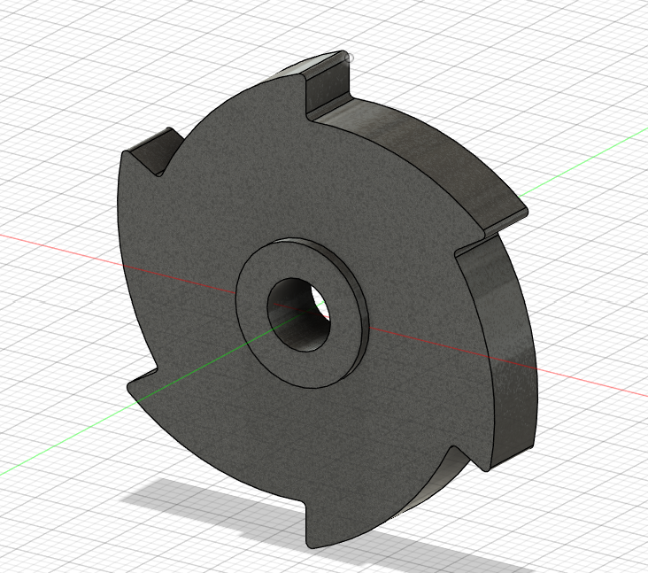
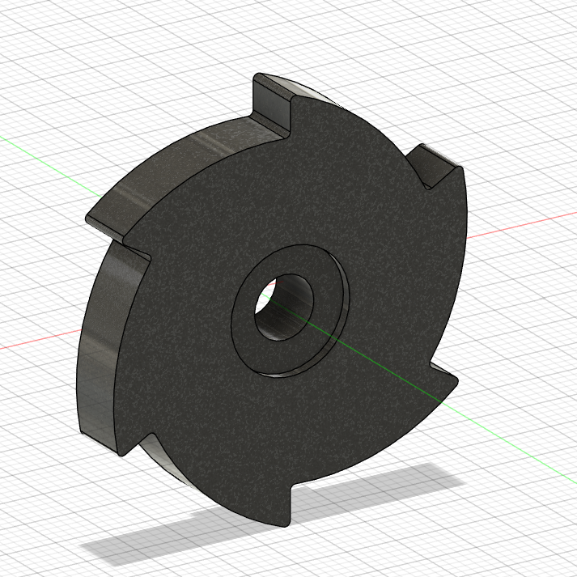

# Machine Design Practice Pack — Part 12: Ratchet Wheel

**Practice source:** Curtis Waguespack / KKMSoft — Machine Design Practice Pack.
Modeled independently in Autodesk Fusion 360 by Sumit Sahu.

[YouTube Reference — link pending]

## Objective
Model a ratchet wheel featuring a central stepped bore with a counterbore/hub detail, and four evenly-spaced rectangular notches cut into the outer rim.

## Skills Practiced
- Circular/polar patterning of features around a full rim
- Counterbore and stepped bore modeling
- Rectangular slot cuts on a curved outer rim
- Combining revolve and extrude-cut operations in one build

## CAD Features Used
- Sketch (circle and rectangle profiles for the bore, hub, and rim notches)
- Extrude (main wheel body, hub boss)
- Extrude Cut (stepped bore, counterbore, rim notches)
- Circular Pattern (4× evenly-spaced rim notches)

## Challenges
Keeping the four rim notches evenly spaced at exactly 90° apart while maintaining a consistent notch depth was the main difficulty — on a curved rim, even a small angular error in one notch throws off the visual and functional symmetry of the whole wheel.

## How I Solved Them
Fully constrained a single notch profile to the wheel's center axis first, then used a Circular Pattern set to exactly 4 instances at 90° spacing — this guaranteed mathematically even spacing rather than risking manual angle placement errors around the rim.

## Engineering Notes
A ratchet wheel's rim notches are designed to engage with a spring-loaded pawl, allowing the wheel to rotate freely in one direction while the pawl catches against a notch face to block rotation in the reverse direction. The stepped bore and counterbore/hub detail likely seat the wheel onto a shaft with a shoulder for axial location, and provide a flush mounting surface for a retaining fastener.

## Manufacturing Considerations
This part is well suited to CNC milling or laser/waterjet cutting from flat stock, given the relatively uniform thickness and the rim notches being straightforward profile cuts. The stepped bore and counterbore would typically be a secondary drilling/boring operation, and the notch faces (the surfaces the pawl engages against) benefit from a controlled, wear-resistant surface finish since they see repeated contact loading in use.

## Material Suggestions
Hardened tool steel or case-hardened mild steel would suit a real ratchet wheel well, given the repeated impact/engagement loading on the notch faces from the pawl. For a 3D-printed practice model, PLA or PETG is sufficient, though a printed part wouldn't hold up to sustained mechanical ratcheting use.

## Improvements
Adding a small chamfer on the leading edge of each notch (the face the pawl first contacts) would ease engagement and reduce wear at that contact point in a real mechanical ratchet application.

## Time Taken
_Pending — let me know and I'll fill this in._

## Final Images

| View | Image |
|------|-------|
| Isometric |  |
| Isometric (alt angle) |  |

## Download Files
- [Model.step](CAD/Model.step)
- [Model.obj](CAD/Model.obj)
- [Model.mtl](CAD/Model.mtl)
