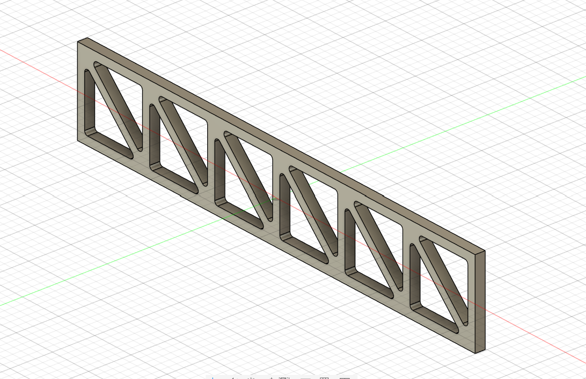

# Machine Design Practice Pack — Part 13: Truss Flange

**Practice source:** Curtis Waguespack / KKMSoft — Machine Design Practice Pack.
Modeled independently in Autodesk Fusion 360 by Sumit Sahu.

[YouTube Reference — link pending]

## Objective
Model a long, narrow structural flange featuring a repeating triangulated truss cutout pattern along its length, replicating a real-world lightweighting technique used in structural brackets and support members.

## Skills Practiced
- Sketch-driven repeating pattern geometry (triangular truss cutouts)
- Rectangular pattern / mirror operations for symmetric cutout repetition
- Precise sketch constraints to keep truss angles and spacing consistent
- Extrude-cut through a thin-walled base flange
- Managing a long, high-aspect-ratio part in the modeling workspace

## CAD Features Used
- Sketch (base flange profile + single truss triangle unit)
- Extrude (base flange body)
- Extrude Cut (triangular cutouts)
- Rectangular Pattern (repeating the truss unit along the flange length)
- Fillet (edge breaks on the flange body)

## Challenges
Keeping the triangular cutouts perfectly consistent in angle and spacing across a long, repeating run was the main difficulty — small sketch errors compound quickly over multiple repetitions and become visually obvious in a linear pattern like this.

## How I Solved Them
Built a single truss triangle as a fully constrained sketch tied to the flange's reference geometry, then used a rectangular pattern to propagate it along the length rather than manually sketching each cutout. This guaranteed identical spacing and angle for every triangle and made later spacing adjustments a single-parameter change.

## Engineering Notes
The alternating triangular cutout pattern is a classic truss-style lightweighting strategy — it removes material from low-stress regions of the flange while the diagonal members continue to carry bending and shear loads efficiently, similar to how a Warren truss works in structural engineering. This keeps the part's stiffness-to-weight ratio high compared to a solid flange of the same envelope.

## Manufacturing Considerations
The narrow diagonal webs and sharp internal corners of the triangular cutouts are better suited to processes that handle thin features well — laser/waterjet cutting from sheet stock, or CNC machining/milling. If 3D printed, the thin diagonal members would need orientation planning to avoid weak layer lines running across the load path.

## Material Suggestions
Aluminum or mild steel sheet would suit this part well if manufactured as a structural bracket — both machine and cut cleanly at this feature scale while keeping the part lightweight. For a 3D-printed version, PLA or PETG would be sufficient for a display/practice model.

## Improvements
Adding a small fillet at the internal vertices of each triangular cutout would reduce stress concentration at those sharp corners in a real load-bearing application.

## Time Taken
_Pending — let me know and I'll fill this in._

## Final Images

| View | Image |
|------|-------|
| Isometric |  |

## Download Files
- [Model.step](CAD/Model.step)
- [Model.obj](CAD/Model.obj)
- [Model.mtl](CAD/Model.mtl)
