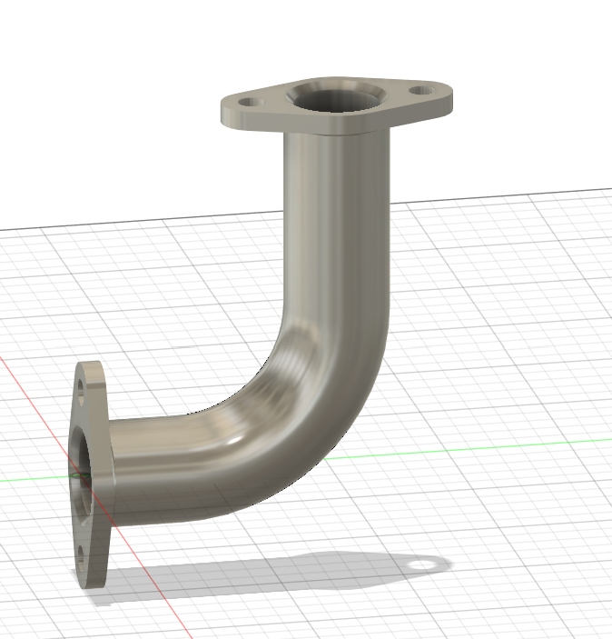
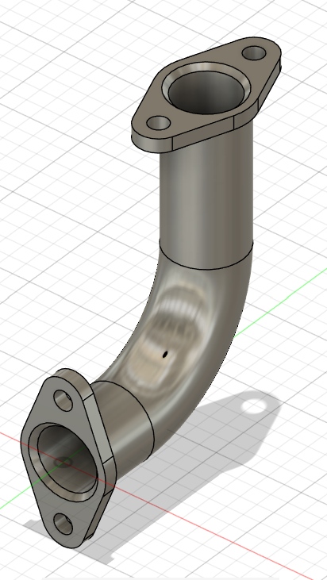

# Part 14 – Flanged 90° Elbow

**Practice source:** Curtis Waguespack / KKMSoft — Machine Design Practice Pack. Modeled independently in Autodesk Fusion 360 by Sumit Sahu.

**YouTube:** _Pending_

## Objective
Model a 90° pipe elbow fitting with a mounting flange at each end, each flange featuring a bolt-hole pattern for bolted pipe-to-pipe or pipe-to-equipment connection.

## Skills Practiced
- Sweep along a curved path for the pipe bend
- Circular flange modeling with bolt-hole patterning
- Shelling/through-bore creation for fluid passage
- Managing tangency between straight pipe runs and the curved elbow section
- Symmetric part design (two matching flange ends)

## CAD Features Used
- Sketch (circular profile for the pipe cross-section, flange outline)
- Sweep (pipe bend along a 90° arc path)
- Extrude (flange plates, boss features)
- Hole (bolt holes on each flange, patterned)
- Shell / Bore (through-hole for the fluid passage)
- Fillet (blending the pipe-to-flange transitions)

## Challenges
The main challenge in a part like this is maintaining a constant wall thickness and bore diameter through the transition from the straight sections into the curved elbow — inconsistent sweep profiles or path curvature can cause the pipe to pinch or balloon at the bend. Aligning the two flanges so their bolt-hole patterns are correctly oriented relative to each other (not accidentally rotated) is also easy to get wrong when the part isn't symmetric about a single plane.

## How I Solved Them
I built the pipe centerline as a single sketched path (two straight segments joined by a 90° arc) and swept a constant circular profile along the entire path in one operation, rather than modeling the bend as a separate loft — this guarantees the bore stays a uniform diameter through the transition. The flanges were built on work planes placed at the exact start and end points of the path, using the path's tangent direction to keep each flange square to its own pipe axis. Bolt holes were placed using a circular pattern referenced from the flange's own center axis, so both flanges stay consistent even though they're modeled independently.

## Engineering Notes
Flanged elbows like this are common wherever a rigid, high-pressure pipe run needs a serviceable joint — the bolted flange lets the fitting be removed for maintenance or inspection without cutting the pipe, unlike a welded elbow. The 90° bend radius should be generous relative to the pipe bore to minimize flow turbulence and pressure drop at the joint; a tight, sharp-radius bend increases resistance and risk of erosion at the outer wall of the curve. The bolt circle diameter and hole count on the flange need to match a standard flange spec (e.g. ASME B16.5) if this were ever intended to mate with off-the-shelf hardware.

## Manufacturing Considerations
A part like this would typically be manufactured either as a casting (sand or investment casting for the elbow-and-flange geometry in one piece) or fabricated by welding a separately-formed pipe bend to two machined flange plates. If cast, the internal bore would need to be cored, and the flange faces would need a final machining pass to get a flat, sealing-quality surface finish. If CNC-machined from bar stock instead, the bend would likely need to be built from a mitered/welded joint rather than machined as one continuous curve, since machining a swept internal passage like this from solid stock is impractical.

## Material Suggestions
Ductile iron or cast steel would be a typical choice for a general industrial piping elbow of this type — good strength and castability. For corrosive or higher-purity fluid service, stainless steel (304/316) would be preferred despite the added cost. For lower-pressure or non-critical applications, cast aluminum could reduce weight where that matters (e.g. mobile equipment piping).

## Improvements
If revisiting this part, I'd add gasket-groove detailing on the flange faces (a shallow recess for an O-ring or gasket) to make the design more representative of a real sealing flange, and parameterize the bolt circle diameter and hole count so the flange size could scale to different pipe schedules without rebuilding the sketch from scratch.

## Time Taken
_Pending — let me know and I'll fill this in._

## Final Images
| View 1 | View 2 |
|--------|--------|
|  |  |

## Download Files
- [Model.step](CAD/Model.step)
- [Model.obj](CAD/Model.obj)
- [Model.mtl](CAD/Model.mtl)
