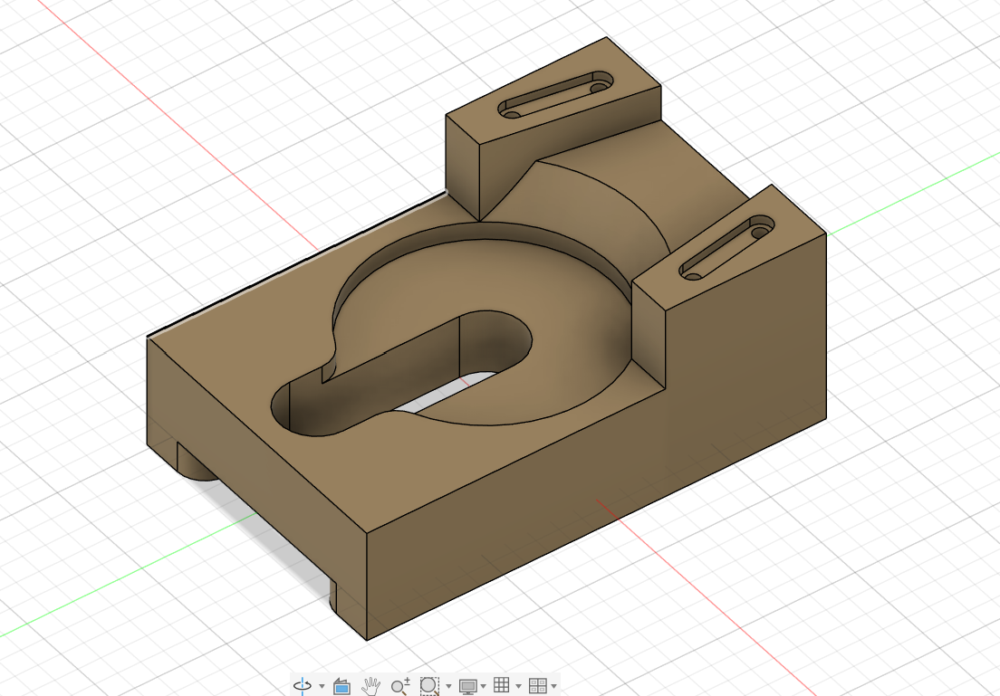
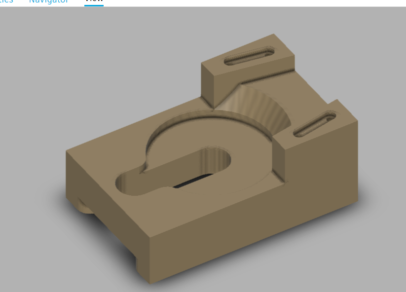
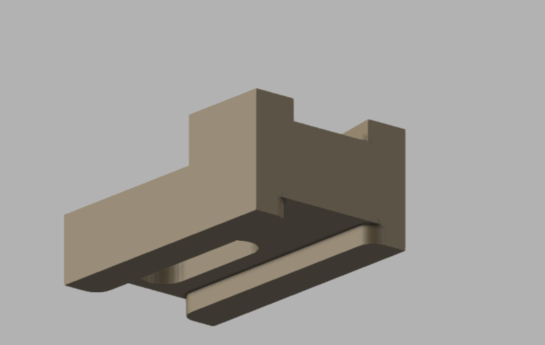

# Machine Design Practice Pack — Part 15: Alignment Catch

**Practice source:** Curtis Waguespack / KKMSoft — Machine Design Practice Pack.
Modeled independently in Autodesk Fusion 360 by Sumit Sahu.

[YouTube Reference — link pending]

## Objective
Model an alignment catch/latch bracket: a base block with a curved central pocket forming a hook-like catch profile, flanked by two raised tabs each featuring an angled slot, sitting on a stepped base.

## Skills Practiced
- Sketch-driven curved pocket/catch profile combining an arc and a straight slot cutout
- Angled slot cutting on raised side tabs
- Extrude Cut for the central hook-shaped catch feature
- Managing a part with a mix of curved (catch pocket) and flat (side tabs) geometry
- Stepped base profile with small foot details

## CAD Features Used
- Sketch (base profile, catch pocket profile, angled slot profiles)
- Extrude (base body, raised side tabs)
- Extrude Cut (curved catch pocket, angled slots, base foot steps)
- Fillet (catch pocket transition edges)

## Challenges
Getting the curved catch pocket's arc and the straight extension slot to blend into one continuous hook-shaped cutout — without a visible seam where the arc meets the straight section — was the main difficulty, since the two geometries need to be tangent to read as a single smooth catch profile.

## How I Solved Them
Constrained the arc and the straight slot line with a tangent constraint at their shared endpoint in the sketch, rather than just visually aligning them, which guaranteed a smooth continuous curve regardless of later dimension changes to either segment.

## Engineering Notes
This part's hook-shaped catch pocket suggests it's designed to receive and locate a mating pin or lever — the curved profile allows something to rotate or slide into position and be captured, while the two angled slots on the raised tabs likely serve as adjustment or mounting slots, letting the bracket's position be fine-tuned before final fastening.

## Manufacturing Considerations
This part is well suited to CNC milling from block stock — the curved catch pocket and angled slots are both standard milling operations, though the catch pocket's tangent arc-to-line transition benefits from a smooth toolpath to avoid a visible tool-mark seam.

## Material Suggestions
Aluminum or mild steel would suit a real alignment catch application well, offering enough wear resistance at the catch surface. For a 3D-printed practice model, PLA or PETG is sufficient.

## Improvements
Adding a small fillet at the catch pocket's mouth (entry point) would ease engagement of a mating pin or lever, reducing the chance of binding during assembly or operation.

## Time Taken
_Pending — let me know and I'll fill this in._

## Final Images

| View | Image |
|------|-------|
| Isometric |  |
| Render |  |
| Render (alt angle) |  |

## Download Files
- [Model.step](CAD/Model.step)

_Note: OBJ/MTL files not provided for this part — only the STEP file is available._
