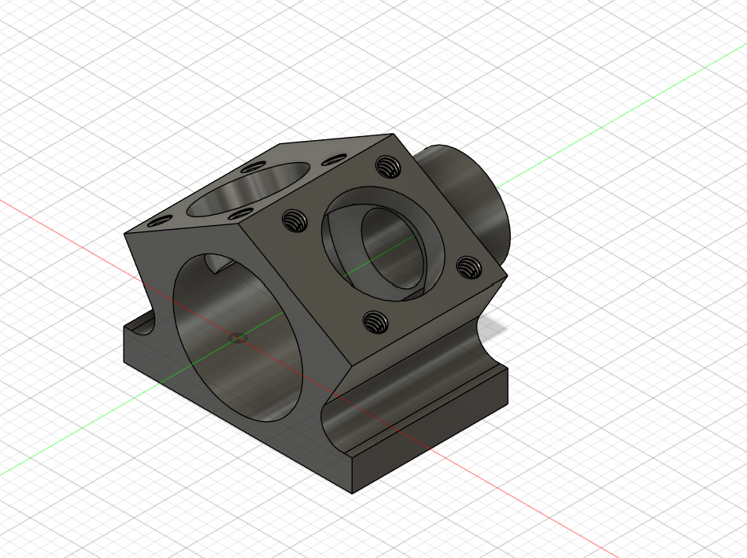
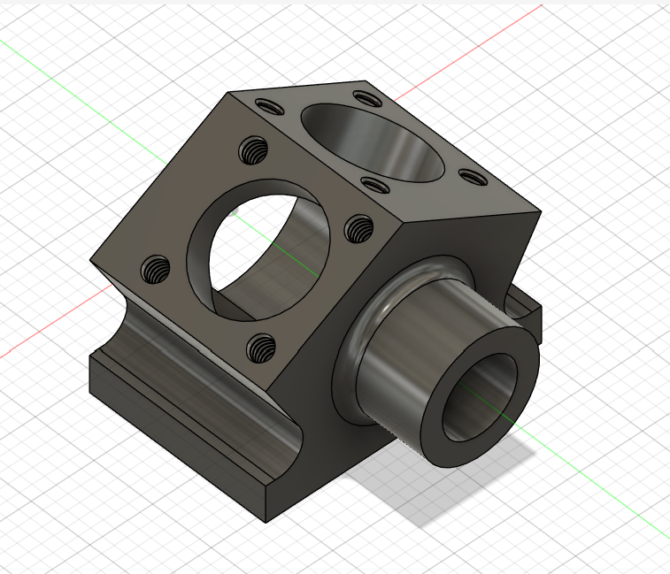

# Part 16 – Mini Crank Case

**Practice source:** Curtis Waguespack / KKMSoft — Machine Design Practice Pack. Modeled independently in Autodesk Fusion 360 by Sumit Sahu.

**YouTube:** _Pending_

## Objective
Model a compact crank case block (concept model for a miniature V-twin engine housing) with two angled cylindrical bores meeting at a shared crankshaft bore, a mounting flange with bolt holes, and a base flange with through-holes for assembly.

## Skills Practiced
- Angled sketch planes for the two V-twin cylinder bores (30° included angle)
- Concentric bore intersection modeling
- Bolt-hole and threaded-hole patterning (M2 x 0.4 threads)
- Multi-plane hole placement across top, side, and bottom faces
- Working from a fully dimensioned, toleranced drawing sheet

## CAD Features Used
- Sketch (circular bore profiles, angled reference planes)
- Extrude (cylinder bosses, crank case block)
- Hole (Ø9 crankshaft bore, Ø6 through-holes, M2x0.4-6H threaded holes)
- Fillet (R1 blend on base flange edge)
- Circular/linear patterning for the 8x M2 threaded holes

## Challenges
_Pending — let me know and I'll fill this in._

## How I Solved Them
_Pending — let me know and I'll fill this in._

## Engineering Notes
This is a concept model for a miniature V-twin crank case — the two cylinder bores are set at a 30° included angle (a common V-twin cylinder bank angle) and intersect at a central Ø12.5 crankshaft bore. The mounting flange carries 8x M2x0.4-6H threaded holes for attaching cylinder heads or covers, while the base flange uses Ø6 through-holes for bolting the case to a larger assembly. Aluminum alloy is specified, consistent with real crank case practice, where low weight and good heat dissipation matter for engine components.

## Manufacturing Considerations
Per the drawing's machining hint, this part is intended to be machined from a 17x22x15 mm block stock, with the bores, flange faces, and holes cut in sequence from that starting blank — a straightforward 3+ axis CNC milling job given the part's modest size and mostly orthogonal/angled planar features. Third-angle projection and a Ra 1.6 surface finish are specified, with general tolerances of ±0.1 mm linear and ±0.5° angular — achievable on a standard CNC mill without special fixturing, though the 30°-angled bore would need either a tilted vise/fixture or a 4th-axis setup to machine accurately in one operation.

## Material Suggestions
Aluminum alloy, as specified on the drawing — appropriate for a real crank case where light weight and thermal conductivity are priorities. A die-cast or 6061-T6 aluminum alloy would be typical choices in production; for a 3D-printed or prototype version, an SLA resin or aluminum-filled filament could approximate the geometry for fit-checking purposes.

## Improvements
_Pending — let me know and I'll fill this in._

## Time Taken
_Pending — let me know and I'll fill this in._

## Final Images
| Isometric | Isometric (Alt) | Drawing Sheet |
|-----------|------------------|---------------|
|  |  |  |

## Download Files
- [Model.step](CAD/Model.step)
- [Model.obj](CAD/Model.obj)
- [Model.mtl](CAD/Model.mtl)
