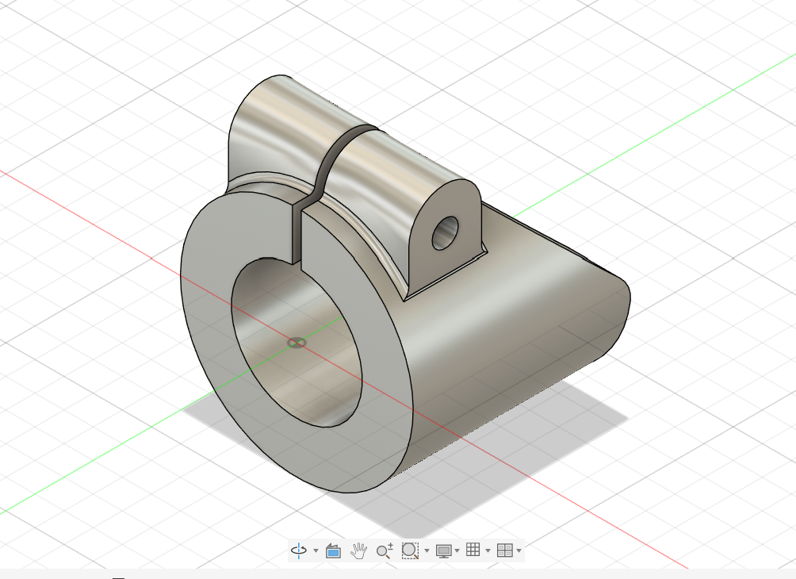
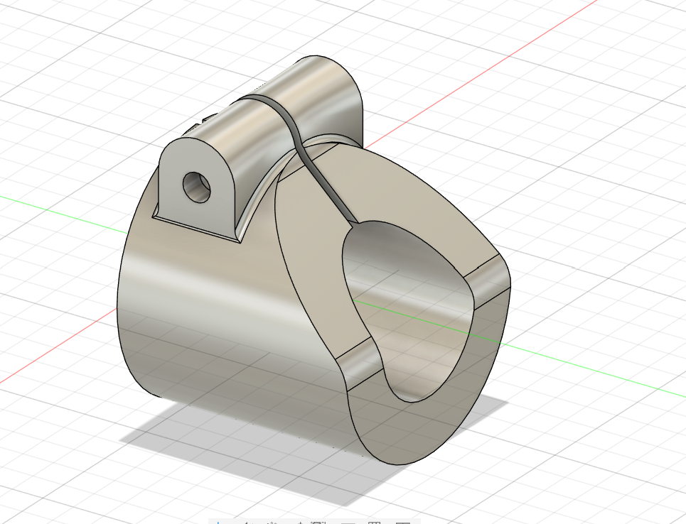

# Part 17 – Pinch Fit Cap

**Practice source:** Curtis Waguespack / KKMSoft — Machine Design Practice Pack. Modeled independently in Autodesk Fusion 360 by Sumit Sahu.

**YouTube:** _Pending_

## Objective
Model a split cylindrical cap fitting with an integrated pinch/clamp ear, featuring a through-bore for mounting over a shaft or rod and a bolt hole in the ear for clamping/tightening.

## Skills Practiced
- Cylindrical shell/tube modeling with a shaft-clearance bore
- Split-body design (open slot along the cylinder length)
- Tangent blend between the cylindrical body and the mounting ear
- Off-axis hole placement on a curved/angled face

## CAD Features Used
- Sketch (circular profiles for the outer cylinder and bore, ear outline)
- Extrude (cylindrical body, ear boss)
- Shell / Bore (through-hole for the shaft passage)
- Fillet (blending the ear-to-cylinder transition)
- Hole (clamping bolt hole through the ear)

## Challenges
_Pending — let me know and I'll fill this in._

## How I Solved Them
_Pending — let me know and I'll fill this in._

## Engineering Notes
_Pending — let me know and I'll fill this in._

## Manufacturing Considerations
_Pending — let me know and I'll fill this in._

## Material Suggestions
_Pending — let me know and I'll fill this in._

## Improvements
_Pending — let me know and I'll fill this in._

## Time Taken
_Pending — let me know and I'll fill this in._

## Final Images
| View 1 | View 2 |
|--------|--------|
|  |  |

## Download Files
- [Model.step](CAD/Model.step)
- [Model.obj](CAD/Model.obj)
- [Model.mtl](CAD/Model.mtl)
