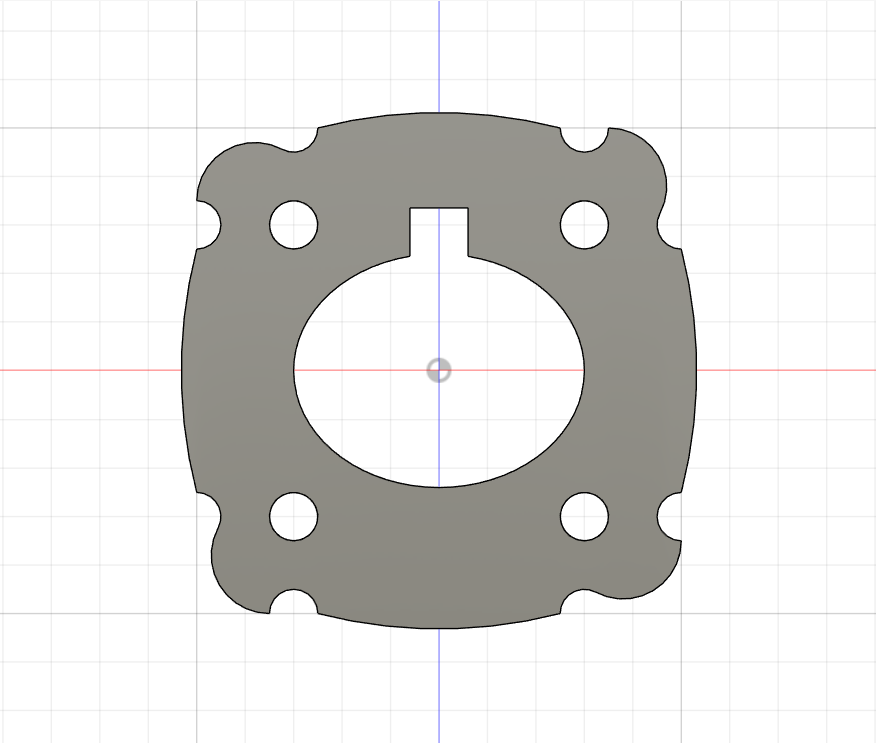
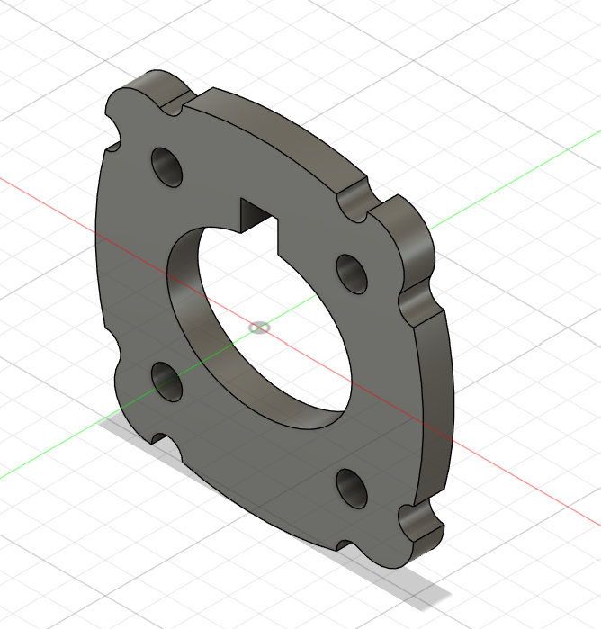

# Part 18 – Slip Nut Insert

**Practice source:** Curtis Waguespack / KKMSoft — Machine Design Practice Pack. Modeled independently in Autodesk Fusion 360 by Sumit Sahu.

**YouTube:** _Pending_

## Objective
Model a flanged insert plate with a central oval bore featuring an internal keyway, four scalloped-corner bolt holes for mounting, and rounded/blended edge transitions around the flange perimeter.

## Skills Practiced
- Elliptical/oval bore profile sketching
- Keyway slot modeling inside a bore
- Scalloped/blended flange corner geometry
- Bolt-hole patterning on a non-circular flange
- Thin-plate extrude with symmetric feature layout

## CAD Features Used
- Sketch (oval bore profile, keyway slot, flange outline with scalloped corners)
- Extrude (flange plate boss + bore cut)
- Fillet (blended scalloped corners, edge breaks)
- Hole (4x bolt holes)

## Challenges
_Pending — let me know and I'll fill this in._

## How I Solved Them
_Pending — let me know and I'll fill this in._

## Engineering Notes
_Pending — let me know and I'll fill this in._

## Manufacturing Considerations
_Pending — let me know and I'll fill this in._

## Material Suggestions
_Pending — let me know and I'll fill this in._

## Improvements
_Pending — let me know and I'll fill this in._

## Time Taken
_Pending — let me know and I'll fill this in._

## Final Images
| Front View | Isometric |
|------------|-----------|
|  |  |

## Download Files
- [Model.step](CAD/Model.step)
- [Model.obj](CAD/Model.obj)
- [Model.mtl](CAD/Model.mtl)
